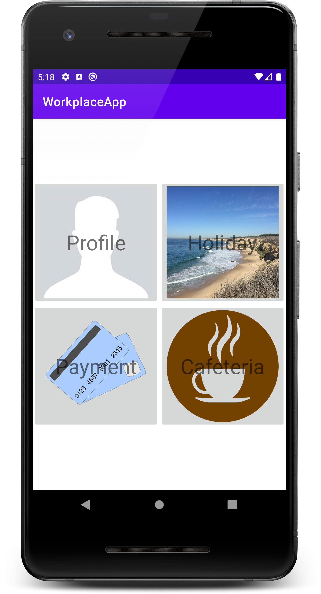
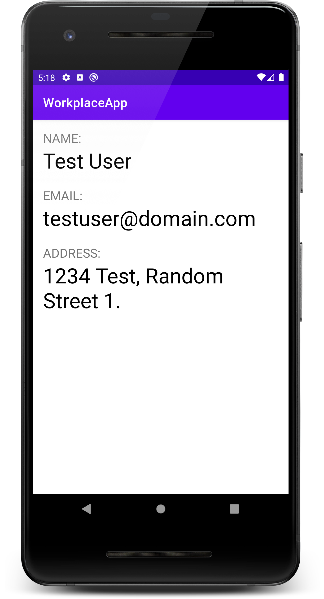
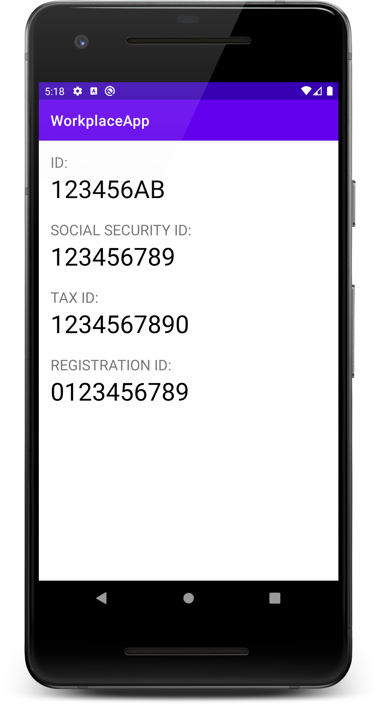
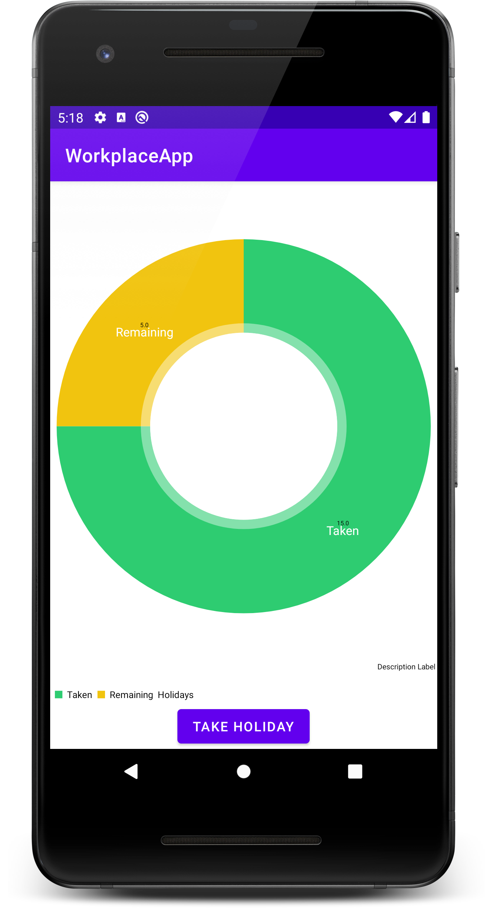
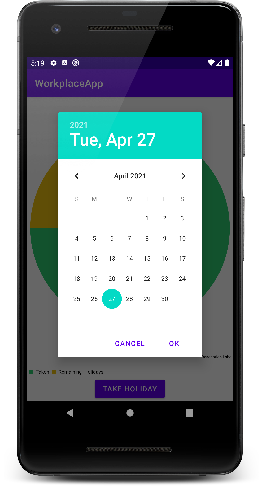

# Labor 02 - Felhasználói felület készítése - Fragmentek, Chartok

## Bevezető

A labor során egy HR alkalmazást készítünk el, amelybe belépve a felhasználó meg tudja tekinteni személyes adatait, illetve szabadságot tud rögzíteni. Az alkalmazás nem használ perzisztens adattárolást és valós bejelentkeztetést, csak demo adatokkal dolgozik. A labor fő témája a Fragmentekkel való felületkészítés lesz.

<p align="center">





</p>

## Értékelés

Vezetett rész (1 pont)
- [Projekt létrehozása](#projekt-létrehozása)
- [Főmenü képernyő](#főmenü-képernyő)
- [Profil képernyő](#profil-képernyő)
- [Szabadság képernyő](#szabadság-képernyő)
- [Dátumválasztó, napok csökkentése](#dátumválasztó-napok-csökkentése)

Önálló feladat (1 pont)
- [Szabadság továbbfejlesztése](#szabadság-továbbfejlesztése)

Bónusz feladatok
- [Fizetés menüpont megvalósítása](#Fizetés-menüpont-megvalósítása)

## Vezetett rész

### Projekt létrehozása

Első lépésként indítsuk el az Android Studio-t, majd:

1. Hozzunk létre egy új projektet, válasszuk az *Add No Activity* lehetőséget.
2. A projekt neve legyen `WorkplaceApp`, a kezdő package pedig `hu.bme.aut.workplaceapp`
3. Nyelvnek válasszuk a *Kotlin*-t.
4. A minimum API szint legyen API21: Android 5.0.
5. Az instant app támogatást, valamint a *Use legacy android.support libraries* pontot **ne** pipáljuk be.

Az első Activity-nk legyen egy Empty Activity, és nevezzük el `MenuActivity`-nek (app-on jobb gomb, New -> Activity -> Empty Activity). A hozzá tartozó layout fájl automatikusan megkapja az `activity_menu.xml` nevet.

Előzetesen töltsük le az alkalmazás képeit tartalmazó [tömörített fájlt](./downloads/res.zip) és bontsuk ki. A benne lévő drawable könyvtárat másoljuk be az app/src/main/res mappába (Studio-ban res mappán állva `Ctrl+V`).

### Főmenü képernyő

Az első Activity amit elkészítünk a navigációért lesz felelős. A labor során 2 funkciót fogunk megvalósítani, ezek a Profil és a Szabadság.

A projekt készítésekor már létrejött `activity_menu.xml` tartalmát cseréljük ki az alábbira:

```xml
<?xml version="1.0" encoding="utf-8"?>
<LinearLayout xmlns:android="http://schemas.android.com/apk/res/android"
    android:layout_width="match_parent"
    android:layout_height="match_parent"
    android:layout_margin="16dp"
    android:gravity="center"
    android:orientation="vertical">

    <LinearLayout
        android:layout_width="match_parent"
        android:layout_height="wrap_content"
        android:orientation="horizontal">

        <FrameLayout
            android:layout_width="0dp"
            android:layout_height="wrap_content"
            android:layout_weight="1">

        </FrameLayout>

        <FrameLayout
            android:layout_width="0dp"
            android:layout_height="wrap_content"
            android:layout_weight="1">

        </FrameLayout>
    </LinearLayout>

    <LinearLayout
        android:layout_width="match_parent"
        android:layout_height="wrap_content"
        android:orientation="horizontal">

        <FrameLayout
            android:layout_width="0dp"
            android:layout_height="wrap_content"
            android:layout_weight="1">

        </FrameLayout>

        <FrameLayout
            android:layout_width="0dp"
            android:layout_height="wrap_content"
            android:layout_weight="1">

        </FrameLayout>

    </LinearLayout>

</LinearLayout>
```

Egy függőleges LinearLayout-ba tettünk bele 2 vízszintes LinearLayout-ot, mindkettő 2 gombot fog tartalmazni. Súlyozás segítségével 2 részre osztottuk a vízszintes LinearLayout-okat.
A gombon a háttér és a felirat elhelyezéséhez a korábbi laboron már látotthoz hasonlóan FrameLayout-ot fogunk használni.

Az első gombot például így készíthetjük el (a `FrameLayout` tagbe írjuk):
```xml
<ImageButton
    android:id="@+id/btnProfile"
    android:layout_width="match_parent"
    android:layout_height="match_parent"
    android:adjustViewBounds="true"
    android:scaleType="fitCenter"
    android:src="@drawable/profile" />

<TextView
    android:layout_width="wrap_content"
    android:layout_height="wrap_content"
    android:layout_gravity="center"
    android:text="Profile"
    android:textSize="34sp" />
```

A további 3 gombot ennek a mintájára készítsük el ezekkel az értékekkel:

| Szöveg | ID | Kép |
| -- | -- | -- |
| Holiday | `@+id/btnHoliday` | `@drawable/holiday` |
| Payment | `@+id/btnPayment` | `@drawable/payment` |
| Cafeteria | `@+id/btnCafeteria` | `@drawable/cafeteria` |

Ne felejtsük el a szövegeket kiszervezni erőforrásba! (a szövegen állva `Alt+Enter`)

Hozzunk létre a két új Empty Activity-t (`ProfileActivity` és `HolidayActivity`)

A MenuActivity Java fájljában (`MenuActivity.kt`) keressük ki a gombokat és rendeljünk a lenyomásukhoz eseménykezelőt az onCreate metódusban:

```kotlin
btnProfile.setOnClickListener {
            val profileIntent = Intent(this@MenuActivity, ProfileActivity::class.java)
            startActivity(profileIntent)
        }
btnHoliday.setOnClickListener {
            val holidayIntent = Intent(this@MenuActivity, HolidayActivity::class.java)
            startActivity(holidayIntent)
        } });
```

Mivel az Activityt kézzel hoztuk létre, így az első futtatás előtt meg kell adnunk az `AndroidManifest.xml` file-ban, hogy mi legyen az alkalmazás belépési pontja.

```xml
…
<activity android:name=".MenuActivity">
            <intent-filter>
                <action android:name="android.intent.action.MAIN" />
                <category android:name="android.intent.category.LAUNCHER" />
            </intent-filter>
</activity>
```


Próbáljuk ki az alkalmazást! 4 gombnak kell megjelennie és a felső kettőn működnie kell a navigációnak a (még) üres Activity-kbe.

### Profil képernyő

A Profil képernyő két lapozható oldalból fog állni, ezen a név, email, lakcím (első oldal), illetve a személyigazolvány szám, TAJ szám, adószám és törzsszám (második oldal) fognak megjelenni.

Hozzunk létre egy `data` package-et, azon belül egy `Person` osztályt, ebben fogjuk tárolni az oldalakon megjelenő adatokat:

### Szabadság képernyő

### Dátumválasztó, napok csökkentése

## Önálló feladat
### Szabadság továbbfejlesztése

## Bónusz feladatok
### Fizetés menüpont megvalósítása
