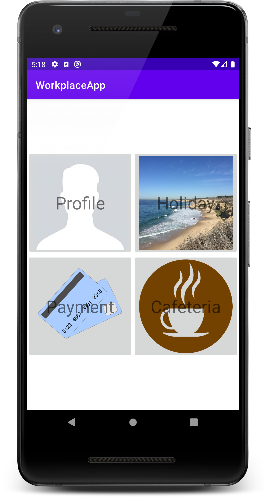
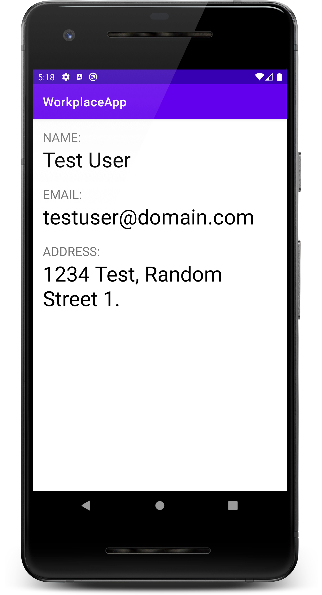
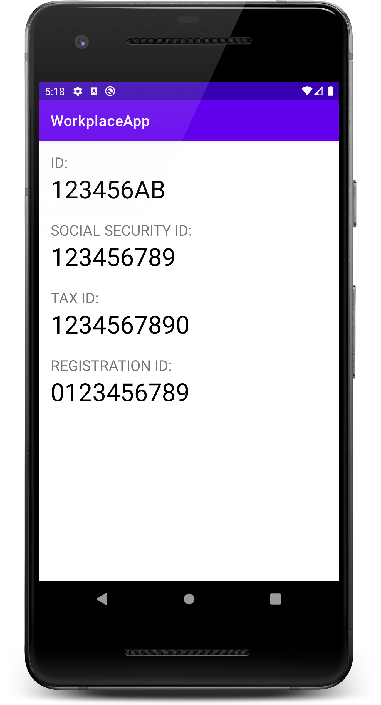
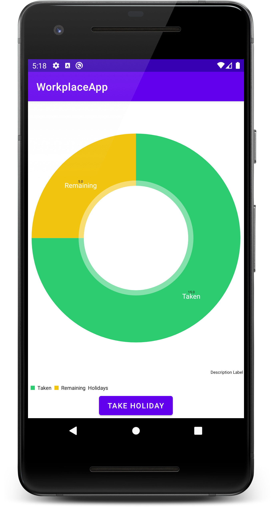

# Labor 02 - Felhasználói felület készítése - Fragmentek, Chartok

## Bevezető

A labor során egy HR alkalmazást készítünk el, amelybe belépve a felhasználó meg tudja tekinteni személyes adatait, illetve szabadságot tud rögzíteni. Az alkalmazás nem használ perzisztens adattárolást és valós bejelentkeztetést, csak demo adatokkal dolgozik. A labor fő témája a Fragmentekkel való felületkészítés lesz.

<p align="center">





</p>

## Értékelés

Vezetett rész (0,5 pont)
- [Projekt létrehozása](#projekt-létrehozása)
- [Főmenü képernyő](#főmenü-képernyő)
- [Profil képernyő](#profil-képernyő)
- [Szabadság képernyő](#szabadság-képernyő)
- [Dátumválasztó, napok csökkentése](#dátumválasztó-napok-csökkentése)

Önálló feladat (0,5 pont)
- [Szabadság továbbfejlesztése](#szabadság-továbbfejlesztése)

Bónusz feladat
- [Fizetés menüpont megvalósítása](#Fizetés-menüpont-megvalósítása)

## Vezetett rész

### Projekt létrehozása

Első lépésként indítsuk el az Android Studio-t, majd:

1. Hozzunk létre egy új projektet, válasszuk az *Add No Activity* lehetőséget.
2. A projekt neve legyen `WorkplaceApp`, a kezdő package pedig `hu.bme.aut.android.workplaceapp`
3. Nyelvnek válasszuk a *Kotlin*-t.
4. A minimum API szint legyen API21: Android 5.0.
5. Az instant app támogatást, valamint a *Use legacy android.support libraries* pontot **ne** pipáljuk be.

Amint elkészült a projektünk, kapcsoljuk is be a `ViewBinding`-ot. Az `app` modulhoz tartozó `build.gradle` fájlban az `android` tagen belülre illesszük be az engedélyezést (Ezek után kattintsunk jobb felül a `Sync Now` gombra.):

```kotlin
android {
    ...
    buildFeatures {
        viewBinding true
    }
}

```

Az első Activity-nk legyen egy Empty Activity, és nevezzük el `MenuActivity`-nek (app-on jobb gomb, New -> Activity -> Empty Activity). A hozzá tartozó layout fájl automatikusan megkapja az `activity_menu.xml` nevet. Állítsuk be azt is, hogy ez az Activity launcher Activity legyen.

Előzetesen töltsük le az alkalmazás képeit tartalmazó [tömörített fájlt](./downloads/res.zip) és bontsuk ki. Itt most csak egy méretben állnak rendelkezésre a képek, de ezen könnyen segíthetünk. Számos online asset creatort találhatunk erre a célra. Ilyen például az [Image Baker](https://www.img-bak.in/) is. Itt ha behúzzuk az oldalra a képeinket, rögtön le is tudjuk tölteni a megfelelő állományokat. Ezeket a drawable könyvtárakat másoljuk be az app/src/main/res mappába (Studio-ban res mappán állva `Ctrl+V`).

### Főmenü képernyő

Az első Activity amit elkészítünk a navigációért lesz felelős. A labor során 2 funkciót fogunk megvalósítani, ezek a Profil és a Szabadság.

A projekt készítésekor már létrejött `activity_menu.xml` tartalmát cseréljük ki az alábbira:

```xml
<?xml version="1.0" encoding="utf-8"?>
<LinearLayout xmlns:android="http://schemas.android.com/apk/res/android"
    android:layout_width="match_parent"
    android:layout_height="match_parent"
    android:layout_margin="16dp"
    android:gravity="center"
    android:orientation="vertical">

    <LinearLayout
        android:layout_width="match_parent"
        android:layout_height="wrap_content"
        android:orientation="horizontal">

        <FrameLayout
            android:layout_width="0dp"
            android:layout_height="wrap_content"
            android:layout_weight="1">

        </FrameLayout>

        <FrameLayout
            android:layout_width="0dp"
            android:layout_height="wrap_content"
            android:layout_weight="1">

        </FrameLayout>
    </LinearLayout>

    <LinearLayout
        android:layout_width="match_parent"
        android:layout_height="wrap_content"
        android:orientation="horizontal">

        <FrameLayout
            android:layout_width="0dp"
            android:layout_height="wrap_content"
            android:layout_weight="1">

        </FrameLayout>

        <FrameLayout
            android:layout_width="0dp"
            android:layout_height="wrap_content"
            android:layout_weight="1">

        </FrameLayout>

    </LinearLayout>

</LinearLayout>
```

Egy függőleges LinearLayout-ba tettünk bele 2 vízszintes LinearLayout-ot, mindkettő 2 gombot fog tartalmazni. Súlyozás segítségével 2 részre osztottuk a vízszintes LinearLayout-okat.
A gombon a háttér és a felirat elhelyezéséhez a korábbi laboron már látotthoz hasonlóan FrameLayout-ot fogunk használni.

Az első gombot például így készíthetjük el (a `FrameLayout` tagbe írjuk):
```xml
<ImageButton
    android:id="@+id/btnProfile"
    android:layout_width="match_parent"
    android:layout_height="match_parent"
    android:adjustViewBounds="true"
    android:scaleType="fitCenter"
    android:src="@drawable/profile" />

<TextView
    android:layout_width="wrap_content"
    android:layout_height="wrap_content"
    android:layout_gravity="center"
    android:text="Profile"
    android:textSize="34sp" />
```

A további 3 gombot ennek a mintájára készítsük el ezekkel az értékekkel:

| Szöveg | ID | Kép |
| -- | -- | -- |
| Holiday | `@+id/btnHoliday` | `@drawable/holiday` |
| Payment | `@+id/btnPayment` | `@drawable/payment` |
| Cafeteria | `@+id/btnCafeteria` | `@drawable/cafeteria` |

Ne felejtsük el a szövegeket kiszervezni erőforrásba! (a szövegen állva `Alt+Enter`)

Hozzunk létre a két új Empty Activity-t (`ProfileActivity` és `HolidayActivity`)

A MenuActivity fájljában (`MenuActivity.kt`), a binding beállítása után, rendeljünk a gombok lenyomásához eseménykezelőt az onCreate metódusban:

```kotlin
class MenuActivity : AppCompatActivity() {
    lateinit var binding: ActivityMenuBinding

    override fun onCreate(savedInstanceState: Bundle?) {
        super.onCreate(savedInstanceState)
        binding = ActivityMenuBinding.inflate(layoutInflater)
        setContentView(binding.root)

        binding.btnProfile.setOnClickListener {
            val profileIntent = Intent(this, ProfileActivity::class.java)
            startActivity(profileIntent)
        }

        binding.btnHoliday.setOnClickListener {
            val holidayIntent = Intent(this, HolidayActivity::class.java)
            startActivity(holidayIntent)
        }
    }
}
```

Mivel az Activityt kézzel hoztuk létre, így az első futtatás előtt meg kell adnunk az `AndroidManifest.xml` file-ban, hogy mi legyen az alkalmazás belépési pontja.

```xml
…
<activity
    android:name=".MenuActivity"
    android:exported="true">
    <intent-filter>
        <action android:name="android.intent.action.MAIN" />
        <category android:name="android.intent.category.LAUNCHER" />
    </intent-filter>
</activity>
```

Próbáljuk ki az alkalmazást! 4 gombnak kell megjelennie és a felső kettőn működnie kell a navigációnak a (még) üres Activity-kbe.

### Profil képernyő

A Profil képernyő két lapozható oldalból fog állni, ezen a név, email, lakcím (első oldal), illetve a személyigazolvány szám, TAJ szám, adószám és törzsszám (második oldal) fognak megjelenni.

Hozzunk létre egy `data` package-et (jobb egérgomb hu.bme.aut.workplaceapp -> New -> Package), azon belül egy `Person` osztályt (New -> Kotlin File/Class -> Kind: Class), ebben fogjuk tárolni az oldalakon megjelenő adatokat:

```kotlin
class Person(
    val name: String,
    val email: String,
    val address: String,
    val id: String,
    val socialSecurityNumber: String,
    val taxId: String,
    val registrationId: String
)
```

A Person osztály példányának elérésére hozzunk létre egy `DataManager` osztályt (szintén a `data` package-en belül), ezzel fogjuk szimulálni a valós adatelérést. Ehhez a Singleton mintát használunk, hogy az alkalmazás minden részéből egyszerűen elérhető legyen. A Person példányt rögtön létre is hozzuk.

> Kotlinban nyelvi szintű támogatás van a singletonok létrehozására. Ahelyett, hogy nekünk kéne egyetlen statikus példányt felvennünk, elég csak a `class` kulcsszó helyett az [`object`](https://kotlinlang.org/docs/reference/object-declarations.html#object-declarations) kulcsszóval létrehoznunk az osztályt hogy egy singletont kapjunk.

```kotlin
object DataManager {
    val person: Person = Person(
        "Test User", "testuser@domain.com",
        "1234 Test, Random Street 1.",
        "123456AB",
        "123456789",
        "1234567890",
        "0123456789"
    )
}
```

Ezután elkészíthetjük a két oldalt, Fragmentekkel. Hozzuk létre egy új `fragments` package-ben a két Fragmentet (New -> Kotlin File/Class -> Kind: Class), ezek neve legyen `MainProfileFragment` és `DetailsProfileFragment`.

A két Fragmentben származzunk le a Fragment osztályból (androidx-es verziót válasszuk) és definiáljuk felül az onCreateView metódust. Ebben töltsük be a layout-ot, majd az onViewCreated metódusban a Person objektum adatait írjuk ki a TextView-kra.

`MainProfileFragment.kt`:
```kotlin
class MainProfileFragment : Fragment() {
    private var _binding: FragmentMainProfileBinding? = null

    private val binding get() = _binding!!

    override fun onCreateView(
        inflater: LayoutInflater,
        container: ViewGroup?,
        savedInstanceState: Bundle?
    ): View? {
        _binding = FragmentMainProfileBinding.inflate(inflater, container, false)
        return binding.root
    }

    override fun onViewCreated(view: View, savedInstanceState: Bundle?) {
        super.onViewCreated(view, savedInstanceState)

        val person: Person = DataManager.person

        binding.tvName.text = person.name
        binding.tvEmail.text = person.email
        binding.tvAddress.text = person.address
    }
}
```

`DetailsProfileFragment.kt`:
```kotlin
class DetailsProfileFragment : Fragment() {
    private var _binding: FragmentDetailsProfileBinding? = null

    private val binding get() = _binding!!

    override fun onCreateView(
        inflater: LayoutInflater,
        container: ViewGroup?,
        savedInstanceState: Bundle?
    ): View? {
        _binding = FragmentDetailsProfileBinding.inflate(inflater, container, false)
        return binding.root
    }

    override fun onViewCreated(view: View, savedInstanceState: Bundle?) {
        super.onViewCreated(view, savedInstanceState)

        val person: Person = DataManager.person

        binding.tvId.text = person.id
        binding.tvSSN.text = person.socialSecurityNumber
        binding.tvTaxId.text = person.taxId
        binding.tvRegistrationId.text = person.registrationId
    }
}
```

Készítsük el a megfelelő layout-okat a Fragmentekhez (`fragment_main_profile` és `fragment_details_profile`) a layout mappába (jobb klikk > new layout resource file).

`fragment_main_profile.xml`:
```xml
<?xml version="1.0" encoding="utf-8"?>
<LinearLayout xmlns:android="http://schemas.android.com/apk/res/android"
    android:layout_width="match_parent"
    android:layout_height="match_parent"
    android:orientation="vertical"
    android:padding="16dp">

    <TextView
        android:layout_width="wrap_content"
        android:layout_height="wrap_content"
        android:text="Name:"
        android:textAllCaps="true"
        android:textSize="20sp" />

    <TextView
        android:id="@+id/tvName"
        android:layout_width="match_parent"
        android:layout_height="wrap_content"
        android:layout_marginBottom="20dp"
        android:textColor="#000000"
        android:textSize="34sp" />

    <TextView
        android:layout_width="wrap_content"
        android:layout_height="wrap_content"
        android:text="Email:"
        android:textAllCaps="true"
        android:textSize="20sp" />

    <TextView
        android:id="@+id/tvEmail"
        android:layout_width="match_parent"
        android:layout_height="wrap_content"
        android:layout_marginBottom="20dp"
        android:textColor="#000000"
        android:textSize="34sp" />

    <TextView
        android:layout_width="wrap_content"
        android:layout_height="wrap_content"
        android:text="Address:"
        android:textAllCaps="true"
        android:textSize="20sp" />

    <TextView
        android:id="@+id/tvAddress"
        android:layout_width="match_parent"
        android:layout_height="wrap_content"
        android:layout_marginBottom="20dp"
        android:textColor="#000000"
        android:textSize="34sp" />

</LinearLayout>
```

`fragment_details_profile.xml`:
```xml
<?xml version="1.0" encoding="utf-8"?>
<LinearLayout xmlns:android="http://schemas.android.com/apk/res/android"
    android:layout_width="match_parent"
    android:layout_height="match_parent"
    android:orientation="vertical"
    android:padding="16dp">

    <TextView
        android:layout_width="wrap_content"
        android:layout_height="wrap_content"
        android:text="ID:"
        android:textAllCaps="true"
        android:textSize="20sp" />

    <TextView
        android:id="@+id/tvId"
        android:layout_width="match_parent"
        android:layout_height="wrap_content"
        android:layout_marginBottom="20dp"
        android:textColor="#000000"
        android:textSize="34sp" />

    <TextView
        android:layout_width="wrap_content"
        android:layout_height="wrap_content"
        android:text="Social Security ID:"
        android:textAllCaps="true"
        android:textSize="20sp" />

    <TextView
        android:id="@+id/tvSSN"
        android:layout_width="match_parent"
        android:layout_height="wrap_content"
        android:layout_marginBottom="20dp"
        android:textColor="#000000"
        android:textSize="34sp" />

    <TextView
        android:layout_width="wrap_content"
        android:layout_height="wrap_content"
        android:text="Tax ID:"
        android:textAllCaps="true"
        android:textSize="20sp" />

    <TextView
        android:id="@+id/tvTaxId"
        android:layout_width="match_parent"
        android:layout_height="wrap_content"
        android:layout_marginBottom="20dp"
        android:textColor="#000000"
        android:textSize="34sp" />

    <TextView
        android:layout_width="wrap_content"
        android:layout_height="wrap_content"
        android:text="Registration ID:"
        android:textAllCaps="true"
        android:textSize="20sp" />

    <TextView
        android:id="@+id/tvRegistrationId"
        android:layout_width="match_parent"
        android:layout_height="wrap_content"
        android:layout_marginBottom="20dp"
        android:textColor="#000000"
        android:textSize="34sp" />

</LinearLayout>
```

(Szervezzük ki a szövegeket erőforrásba)

Már csak a lapozás megvalósítása maradt hátra, ezt a ViewPager osztállyal fogjuk megvalósítani.

Az `activity_profile.xml` fájlba hozzunk létre egy `ViewPager`-t:
```xml
<?xml version="1.0" encoding="utf-8"?>
<LinearLayout xmlns:android="http://schemas.android.com/apk/res/android"
    xmlns:tools="http://schemas.android.com/tools"
    android:layout_width="match_parent"
    android:layout_height="match_parent"
    android:orientation="vertical"
    tools:context="hu.bme.aut.android.workplaceapp.ProfileActivity">

    <androidx.viewpager2.widget.ViewPager2
        android:id="@+id/vpProfile"
        android:layout_width="match_parent"
        android:layout_height="match_parent" />
</LinearLayout>
```

A ViewPager osztály egy FragmentStateAdapter osztály segítségével tudja az oldalakat létrehozni. Hozzunk létre egy új `adapter` package-be egy ProfilePagerAdaptert a két Fragmentünkhöz. 

`ProfilePagerAdapter.kt`:
```kotlin
class ProfilePagerAdapter(fa: FragmentActivity): FragmentStateAdapter(fa) {
    companion object {
        private const val NUM_PAGES = 2
    }

    override fun createFragment(position: Int): Fragment {
        return when(position){
            0 -> MainProfileFragment()
            1 -> DetailsProfileFragment()
            else -> MainProfileFragment ()
        }
    }

    override fun getItemCount(): Int = NUM_PAGES
}
```

A ProfileActivity-ben rendeljük hozzá a ViewPagerhez a most elkészített adaptert (onCreate metódus a `ViewBinding` beállítása után): 
```kotlin
binding.vpProfile.adapter = ProfilePagerAdapter(this)
```

Próbáljuk ki az alkalmazást. A Profile gombra kattinva megjelennek a felhasználó adatai és lehet lapozni is.

### Szabadság képernyő

A Szabadság képernyőn egy kördiagramot fogunk megjeleníteni, ami mutatja, hogy mennyi szabadságot vettünk már ki és mennyi maradt. Ezen kívül egy gomb segítségével új szabadnap kivételét is megengedjük a felhasználónak.

Először egészítsük ki a DataManager osztályunkat, hogy kezelje a szabadsághoz kapcsolódó adatokat is:
```kotlin
private const val HOLIDAY_MAX_VALUE = 20
private const val HOLIDAY_DEFAULT_VALUE = 15

var holidays = HOLIDAY_DEFAULT_VALUE
…
fun getRemainingHolidays(): Int = HOLIDAY_MAX_VALUE - holidays
```

A PieChart kirajzolásához az [MPAndroidChart](https://github.com/PhilJay/MPAndroidChart) library-t fogjuk használni.

Ennek importálásához fel kell vennünk a Projekt szintű settings.gradle-be a megfelelő maven repository-t:
```groovy
dependencyResolutionManagement {
    ...
    repositories {
        ...
        maven { url "https://jitpack.io"}
    }
}
```

Illetve az App szintű build.gradle-be a megfelelő függőséget:
```groovy
dependencies {
    ...
    implementation 'com.github.PhilJay:MPAndroidChart:v3.1.0'
}
```

Ezután kattinsunk a `Sync Now` feliratra.

Ha a library fájljai letöltődtek, akkor írjuk meg az Activity layout-ját (`activity_holiday.xml`):
```xml
<?xml version="1.0" encoding="utf-8"?>
<LinearLayout xmlns:android="http://schemas.android.com/apk/res/android"
    xmlns:tools="http://schemas.android.com/tools"
    android:layout_width="match_parent"
    android:layout_height="match_parent"
    android:orientation="vertical"
    tools:context="hu.bme.aut.android.workplaceapp.HolidayActivity">

    <com.github.mikephil.charting.charts.PieChart
        android:id="@+id/chartHoliday"
        android:layout_width="match_parent"
        android:layout_height="0dp"
        android:layout_weight="1" />

    <Button
        android:id="@+id/btnTakeHoliday"
        android:layout_width="wrap_content"
        android:layout_height="wrap_content"
        android:text="Take Holiday"
        android:layout_gravity="center" />

</LinearLayout>
```

Írjuk meg az Activity kódját (`HolidayActivity.kt`):
```kotlin
class HolidayActivity : AppCompatActivity() {
    private lateinit var binding: ActivityHolidayBinding

    override fun onCreate(savedInstanceState: Bundle?) {
        super.onCreate(savedInstanceState)
        binding = ActivityHolidayBinding.inflate(layoutInflater)
        setContentView(binding.root)

        binding.btnTakeHoliday.setOnClickListener {
            // TODO: DatePickerDialogFragment megjelenítése
        }

        loadHolidays()
    }

    private fun loadHolidays() {
        val entries: ArrayList<PieEntry> = ArrayList()

        entries.add(PieEntry(DataManager.holidays.toFloat(), "Taken"))
        entries.add(PieEntry(DataManager.getRemainingHolidays().toFloat(), "Remaining"))

        val dataSet = PieDataSet(entries, "Holidays")
        dataSet.setColors(*ColorTemplate.MATERIAL_COLORS)

        val data = PieData(dataSet)
        binding.chartHoliday.data = data
        binding.chartHoliday.invalidate()

    }
}
```

Próbáljuk ki az alkalmazást! A PieChart most már megjelenik, de a gomb még nem kell, hogy működjön.

### Dátumválasztó, napok csökkentése

A következő lépésben a Take Holiday gombra megjelenő dátumválasztó működését fogjuk megvalósítani. A gomb lenyomására megjelenik egy dátumválasztó és a dátum kiválasztása után a szabad napok eggyel csökkennek.

Hozzunk létre egy DatePickerDialogFragment osztályt:
```kotlin
class DatePickerDialogFragment : DialogFragment(), DatePickerDialog.OnDateSetListener {

    private lateinit var onDateSelectedListener: OnDateSelectedListener

    override fun onAttach(context: Context) {
        super.onAttach(context)

        try {
            onDateSelectedListener = activity as OnDateSelectedListener

        } catch (e: ClassCastException) {
            throw RuntimeException(e)
        }
    }

    override fun onCreateDialog(savedInstanceState: Bundle?): Dialog {
        val c = Calendar.getInstance()
        val year = c.get(Calendar.YEAR)
        val month = c.get(Calendar.MONTH)
        val day = c.get(Calendar.DAY_OF_MONTH)

        return DatePickerDialog(
            requireActivity(), this,
            year, month, day
        )
    }

    override fun onDateSet(view: DatePicker?, year: Int, month: Int, day: Int) {
        onDateSelectedListener.onDateSelected(year, month, day)
    }

    interface OnDateSelectedListener {
        fun onDateSelected(year: Int, month: Int, day: Int)
    }
}
```

Az importoknál a `java.util`-t válasszuk a Calendarhoz, a Fragment-hez pedig az `androidx`-es verziót.

A laborvezetővel vizsgáljuk meg az `OnDateSelectedListener` interface működését. Az osztályt használóknak ezt az interface-t kell implementálnia és a megvalósított `onDateSelected` metódus kapja meg a dátumot.

Állítsuk be a gomb eseménykezelőjét a HolidayActivity-ben, hogy lenyomáskor jelenítse meg a dátumválasztót:
```kotlin
binding.btnTakeHoliday.setOnClickListener {
	DatePickerDialogFragment().show(supportFragmentManager, "DATE_TAG")
}
```

A kiválasztott dátum feldolgozásához implementáljuk az OnDateSelectedListener-t a HolidayActivity-ben:
```kotlin
class HolidayActivity: AppCompatActivity(), 
DatePickerDialogFragment.OnDateSelectedListener {
...

override fun onDateSelected(year: Int, month: Int, day: Int) {
    val numHolidays = DataManager.holidays

    DataManager.holidays = numHolidays + 1

    // Update chart
    loadHolidays()
}
```

Próbáljuk ki az alkalmazást! Most már a gomb is jól kell, hogy működjön, a napok számának is csökkennie kell a diagramon.


## Önálló feladat
### Szabadság továbbfejlesztése

- Csak akkor engedjünk új szabadságot kivenni, ha a kiválasztott nap a mai napnál későbbi. (Érdemes a DatePickerDialog osztálynak utánanézni)
- Ha elfogyott a szabadságkeretünk, akkor a Take Holiday gomb legyen letiltva.


## Bónusz feladat
### Fizetés menüpont megvalósítása

A Payment menüpontra kattintva jelenjen meg egy PaymentActivity rajta egy ViewPager-rel és 2 Fragment-tel (A Profile menüponthoz hasonlóan):
- `PaymentTaxesFragment`: kördiagram, aminek a közepébe van írva az aktuális fizetés és mutatja a nettó jövedelmet illetve a levont adókat (adónként külön)
- `MonthlyPaymentFragment`: egy oszlopdiagramot mutasson 12 oszloppal, a havi szinten lebontott fizetéseket mutatva - érdemes az adatokat itt is a DataManager osztályban tárolni

[Segítség](https://github.com/PhilJay/MPAndroidChart/wiki)


## Feltöltendő állományok

A labor értékeléséhez **két külön** fájlt kell feltölteni:

1. Az elkészült forráskódot egy .zip-ben. Ez generálható az Android Studioval a `File` > `Export` > `Export to Zip File...` menüponttal.

<p align="center"> 

</p>

2. Egy pdf-et, amiben a név, neptun kód és az alábbi képernyőképek szerepelnek (az emulátor, és egy lényegesebb kódrészlet is):

	1. MenuActivity
	2. MainProfileFragment
	3. DetailsProfileFragment
	4. HolidayActivity (ha kész az önálló rész, az is szerepeljen)
	5. DatePickerDialogFragment (ha kész az önálló rész, az is szerepeljen)

<p align="center"> 

</p>
