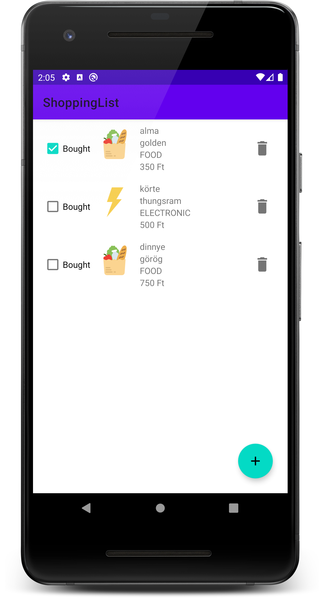
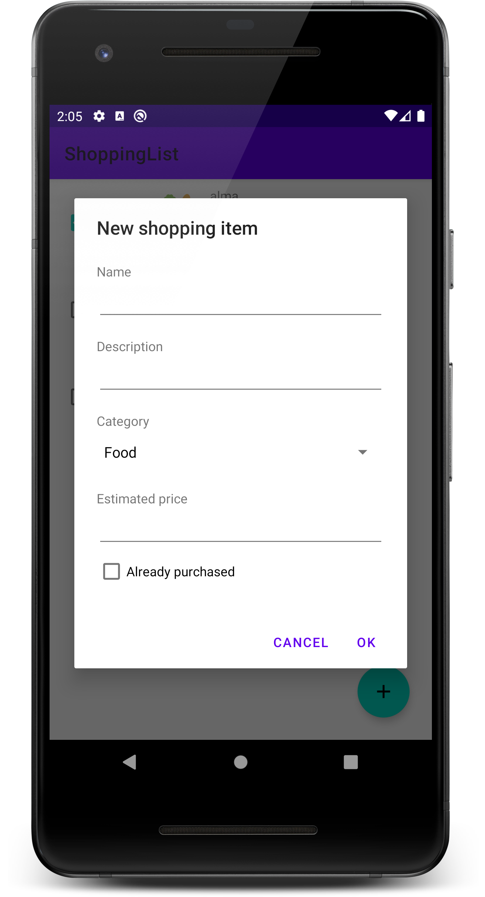
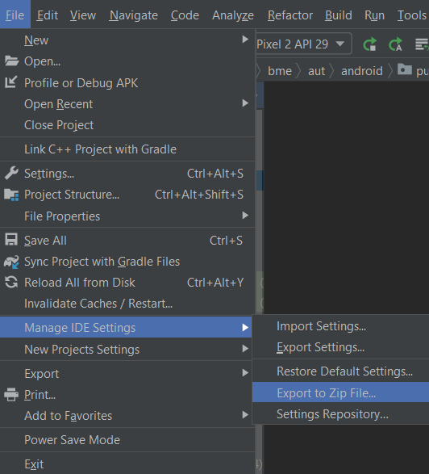
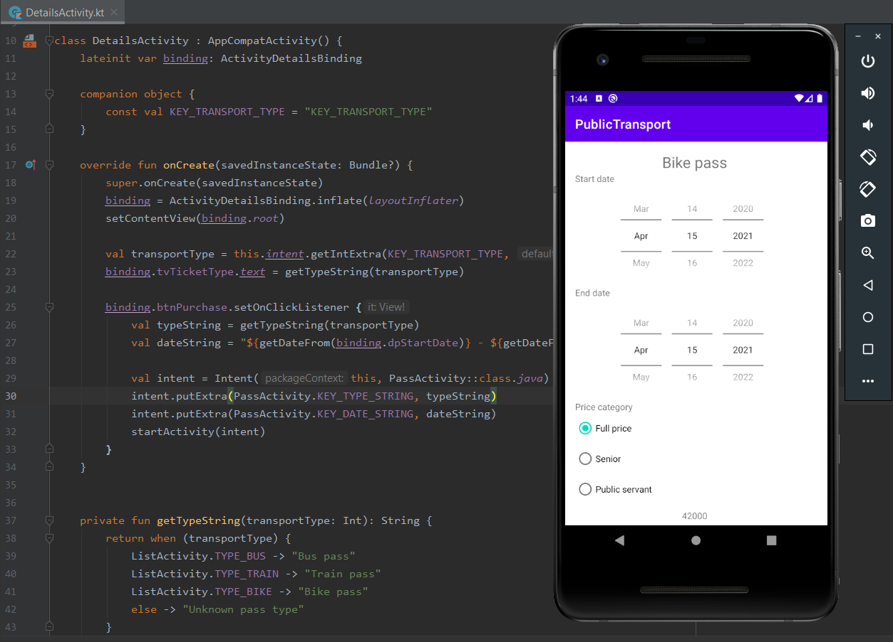

# Labor 03 - Perzisztencia - Bevásárló alkalmazás készítése

## Bevezető
A labor során egy bevásárló lista alkalmazás elkészítése a feladat. Az alkalmazásban fel lehet venni megvásárolni kívánt termékeket, valamint  megvásároltnak lehet jelölni és törölni lehet meglévőket.

Az alkalmazás a termékek listáját [`RecyclerView`](https://developer.android.com/guide/topics/ui/layout/recyclerview)-ban jeleníti meg, a lista elemeket és azok állapotát a [`Room`](https://developer.android.com/training/data-storage/room) nevű ORM library segítségével tárolja perzisztensen. Új elem felvételére egy [`FloatingActionButton`](https://developer.android.com/guide/topics/ui/floating-action-button) megnyomásával van lehetőség.

> ORM = [Object-relational mapping](https://en.wikipedia.org/wiki/Object-relational_mapping)

Az alkalmazás egy `Activity`-ből áll, ami bevásárlólista elemeket jelenít meg. Új elemet a jobb alsó sarokban található `FloatingActionButton` segítségével vehetünk fel. Erre kattintva egy dialógus jelenik meg, amin megadhatjuk a vásárolni kívánt áru nevét, leírását, kategóriáját és becsült árát.
A dialóguson az *OK* gombra kattintva a dialógus eltűnik, a benne megadott adatokkal létrejön egy lista elem a listában. Az egyes lista elemeken `CheckBox` segítségével jelezhetjük, hogy már megvásároltuk őket. A kuka ikonra kattintva törölhetjük az adott elemet.
A menüben található „Remove all” opcióval az összes lista elemet törölhetjük.

<p align="center">


</p>

Felhasznált technológiák:
- [`Activity`](https://developer.android.com/guide/components/activities/intro-activities)
- [`Fragment`](https://developer.android.com/guide/components/fragments)
- [`RecyclerView`](https://developer.android.com/guide/topics/ui/layout/recyclerview)
- [`FloatingActionButton`](https://developer.android.com/guide/topics/ui/floating-action-button) 
- [`Room`](https://developer.android.com/topic/libraries/architecture/room)

## Értékelés

Vezetett rész (0,5 pont)
- [Perzisztens adattárolás megvalósítása](#perzisztens-adattárolás-megvalósítása)
- [Lista megjelenítése `RecyclerView`-val](#lista-megjelenítése-recyclerview-val)
- [Dialógus megvalósítása új elem hozzáadásához](#dialógus-megvalósítása-új-elem-hozzáadásához)

Önálló feladat (0,5 pont)
- [Törlés megvalósítása](#törlés-megvalósítása)

Bónusz feladatok
- [Megerősítő dialógus](#megerősítő-dialógus)
- [Elemek szerkesztése](#elemek-szerkesztése)

Függelék
- [A `build.gradle` fájl tartalma](#a-buildgradle-fájl-tartalma)

## Vezetett rész

### Projekt létrehozása

Első lépésként indítsuk el az Android Studio-t, majd:

1. Hozzunk létre egy új projektet, válasszuk az *Empty Activity* lehetőséget.
2. A projekt neve legyen `ShoppingList`, a kezdő package pedig `hu.bme.aut.android.shoppinglist`
3. Nyelvnek válasszuk a *Kotlin*-t.
4. A minimum API szint legyen API21: Android 5.0.
5. Az instant app támogatást, valamint a *Use legacy android.support libraries* pontot **ne** pipáljuk be.

Amint elkészült a projektünk, kapcsoljuk is be a `ViewBinding`-ot. Az `app` modulhoz tartozó `build.gradle` fájlban az `android` tagen belülre illesszük be az engedélyezést (Ezek után kattintsunk jobb felül a `Sync Now` gombra.):

```kotlin
android {
    ...
    buildFeatures {
        viewBinding true
    }
}

```


Adjuk hozzá a `strings.xml`-hez a projektben szükséges szöveges erőforrásokat:

```xml
<resources>
    <string name="app_name">ShoppingList</string>
    <string name="bought">Bought</string>
    <string name="ok">OK</string>
    <string name="cancel">Cancel</string>
    <string name="new_shopping_item">New shopping item</string>
    <string name="name">Name</string>
    <string name="description">Description</string>
    <string name="category">Category</string>
    <string name="estimated_price">Estimated price</string>
    <string name="already_purchased">Already purchased</string>
    <string-array name="category_items">
        <item>Food</item>
        <item>Electronic</item>
        <item>Book</item>
    </string-array>
</resources>
```

A kezdő Activity neve maradhat `MainActivity`, valamint töltsük le és tömörítsük ki [az alkalmazáshoz szükséges erőforrásokat](downloads/res.zip), majd másoljuk be őket a projekt *app/src/main/res* mappájába (Studio-ban a *res* mappán állva *Ctrl+V*)!

### Perzisztens adattárolás megvalósítása
Az adatok perzisztens tárolásához a `Room` könyvtárat fogjuk használni.

#### Room hozzáadása a projekthez
Kezdjük azzal, hogy az *app* modulhoz tartozó `build.gradle` fájlban a pluginokhoz hozzáírunk egy sort (bekapcsoljuk a Kotlin Annotation Processort - KAPT):

```gradle
plugins {
    id 'com.android.application'
    id 'org.jetbrains.kotlin.android'
    id 'kotlin-kapt'
}

//...
```

Ezt követően, szintén ebben a `build.gradle` fájlban a `dependencies` blokkhoz adjuk hozzá a `Room` libraryt és csatolt részeit:

```gradle
dependencies {
    //...
	//room database
    def room_version = "2.4.2"
    implementation "androidx.room:room-runtime:$room_version"
    kapt "androidx.room:room-compiler:$room_version"

	//room coroutines
    implementation "androidx.room:room-ktx:$room_version"

}
```

Ezután kattintsunk a jobb felső sarokban megjelenő **Sync now** gombra.

A  `Room` egy kényelmes adatbazáskezelést lehetővé tevő API-t nyújt a platform szintű SQLite implementáció fölé. Megspórolható vele rengeteg újra és újra megírandó kód, például a táblák adatait és létrehozó scriptjét tartalmazó osztályok. Ezeket és más segédosztályokat a `Room` *annotation* alapú kódgenerálással hozza létre a *build* folyamat részeként.

A `Room` alapvető komponenseinek, architektúrájának és használatának leírása megtalálható a megfelelő [developer.android.com](https://developer.android.com/training/data-storage/room/) oldalon.

#### Egy modell osztály létrehozása

A `hu.bme.aut.android.shoppinglist` package-ben hozzunk létre egy új package-et `data` néven. A `data` package-ben hozzunk létre egy új Kotlin adat osztályt, aminek a neve legyen `ShoppingItem`:

```kotlin
@Entity(tableName = "shoppingitem")
data class ShoppingItem(
    @ColumnInfo(name = "id") @PrimaryKey(autoGenerate = true) var id: Long = 0,

    @ColumnInfo(name = "name") var name: String,
    @ColumnInfo(name = "category") var category: ShoppingItemCategory,
    @ColumnInfo(name = "description") var description: String = "",
    @ColumnInfo(name = "estimated_price") var estimatedPrice: Int = 0,
    @ColumnInfo(name = "is_bought") var isBought: Boolean = false
)
```

A `data class` property-jeire annotációkat helyeztünk el. Az `@Entity` jelzi a `Room` kódgenerátorának, hogy ennek az osztálynak a példányai adatbázis rekordoknak fognak megfelelni egy táblában és hogy az egyes property-k felelnek majd meg a tábla oszlopainak. A `@ColumnInfo` *annotációval* megadjuk, hogy mi legyen a property-nek megfelelő oszlop neve. `@PrimaryKey`-jel jelöljük a tábla egyszerű kulcs attribútumát.

> Kotlinban van lehetőség úgynevezett [`data class`](https://kotlinlang.org/docs/reference/data-classes.html) létrehozására. Ezt talán legkönnyebben a Java-s POJO (Plain-Old-Java-Object) osztályoknak lehet megfeleltetni. A céljuk, hogy publikus property-kben összefüggő adatokat tároljanak, semmi több! Ezen kívül automatikusan létrejönnek bizonyos segédfüggvények is, például egy megfelelő `equals`, `toString` és `copy` implementáció.

Ugyanide hozzunk létre egy `ShoppingItemCategory` enumot , amivel egy termék kategóriát akarunk kódolni:

```kotlin
enum class ShoppingItemCategory {
    FOOD, ELECTRONIC, BOOK;

    companion object {
        @TypeConverter
        @JvmStatic
        fun getByOrdinal(ordinal: Int): ShoppingItemCategory? {
            var ret: ShoppingItemCategory? = null
            for (cat in values()) {
                if (cat.ordinal == ordinal) {
                    ret = cat
                    break
                }
            }
            return ret
        }

        @TypeConverter
        @JvmStatic
        fun toInt(category: ShoppingItemCategory): Int {
            return category.ordinal
        }
    }
}
```

Az enum-nak van két statikus metódusa, `@TypeConverter` annotációval ellátva. Ezekkel oldható meg, hogy az adatbázis akár összetett adatszerkezeteket is tárolni tudjon. Ezek a függvények felelősek azért, hogy egy felhasználói típust lefordítsanak egy, az adatbázis által támogatott típusra, illetve fordítva. Megfigyelhető továbbá, hogy ezen függvények el vannak látva a `@JvmStatic` annotációval is. Erre azért van szükség, mert alapvetően, amikor a companion object-ek Jvm bájtkódra fordulnak, akkor egy külön statikus osztály jön számukra létre. Ezzel az annotációval lehet megadni, hogy ne jöjjön létre külön statikus osztály, ehelyett a bennfoglaló osztály (jelen esetben `ShoppingItemCategory`) statikus függvényei legyenek. Erre a speciális viselkedésre pedig a Room működése miatt van szükség, ugyanis tudnia kell, hol keresse egy-egy típusra a konvertereket.

#### Egy DAO osztály létrehozása

> DAO = [Data Access Object](https://en.wikipedia.org/wiki/Data_access_object)

A `data` package-ben hozzunk létre egy új Kotlin interfészt, aminek a neve legyen `ShoppingItemDao`:

```kotlin
@Dao
interface ShoppingItemDao {
    @Query("SELECT * FROM shoppingitem")
    suspend fun getAll(): List<ShoppingItem>

    @Insert
    suspend fun insert(shoppingItems: ShoppingItem): Long

    @Update
    suspend fun update(shoppingItem: ShoppingItem)

    @Delete
    suspend fun deleteItem(shoppingItem: ShoppingItem)
}
```

Egy `@Dao` *annotációval* ellátott interfész a `Room` kódgenerátora számára azt jelzi, hogy generálni kell az interfészhez egy olyan implementációt, ami az interfész függvényeket az azokon lévő annotációk (`@Query`, `@Insert`, `@Update`, `@Delete`) alapján valósítja meg.

Figyeljük meg, hogy az Android Studio a `@Query` *annotáció* paramétereként átadott SQLite scriptre is nyújt kódkiegészítést, hiba jelzést!

Érdemes megfigyelni a függvények előtt a `suspend` kulcsszót. Ennek a segítségével Kotlin [coroutine-okat](https://kotlinlang.org/docs/reference/coroutines/coroutines-guide.html) lehet létrehozni, amiket talán legkönnyebben a JavaScript-es / TypeScript-es `async`/`await` kulcsszavakhoz lehet hasonlítani. Az egésznek a célja, hogy mivel adatbázis műveletek hosszú ideig tarthatnak, háttérszálon akarjuk őket futtatni, hogy ne blokkolják a felhasználói felületet. A `suspend` kulcsszóval pedig egy olyan függvényt lehet létrehozni, ami képes háttérszálon futni, és aminek a befejezősédére várakozni lehet.

#### Az adatbázis osztály létrehozása

A `data` package-ben hozzunk létre egy új Kotlin osztályt, aminek a neve legyen `ShoppingListDatabase`:

```kotlin
@Database(entities = [ShoppingItem::class], version = 1)
@TypeConverters(value = [ShoppingItemCategory::class])
abstract class ShoppingListDatabase : RoomDatabase() {
    companion object {
        fun getDatabase(applicationContext: Context): ShoppingListDatabase {
            return Room.databaseBuilder(
                applicationContext,
                ShoppingListDatabase::class.java,
                "shopping-list"
            ).build();
        }
    }

    abstract fun shoppingItemDao(): ShoppingItemDao
}
```

A `@Database` *annotációval* lehet jelezni a kódgenerátornak, hogy egy osztály egy adatbázist fog reprezentálni. Az ilyen osztálynak *absztraktnak* kell lennie, valamint a `RoomDatabase`-ből kell származnia. Az *annotáció* `entities` paraméterének egy listát kell átadni, ami az adatbázis tábláknak megfelelő `@Entity`-vel jelzett osztályokat tartalmazza. A `version` paraméter értéke a lokális adatbázis verzió. A `@TypeConverters` *annotációval* lehet megadni a `Room`-nak olyan osztályokat, amik `@TypeConverter`-rel ellátott függvényeket tartalmaznak, ezzel támogatva a típuskonverziót adatbázis és objektum modell között. A `ShoppingListDatabase` osztály felelős a megfelelő DAO osztályok elérhetőségéért is.

> Bonyolultabb alkalmazásoknál előfordulhat, hogy az adatbázis frissül egy újabb verzióban. Ilyenkor az adatbázis verziót kell nagyobbra állítani, valamint meg lehet adni úgy nevezett migrációs függvényeket, amikben le van kódolva, hogyan kell az adatbázist egy régebbi verzióról egy újabbra frissíteni, az adatok sérülése nélkül.

Ezen kívül van még egy statikus `getDatabase` függvény, ami azt írja le, hogyan kell létrehozni az adatbázist (melyik osztályból, milyen néven). Ez a függvény az alkalmazás kontextusát várja paraméterül.

### Lista megjelenítése `RecyclerView`-val

A listában sok egyforma elemet szeretnénk megjeleníteni. Egy listaelem megjelenítéséhez hozzuk létre a layout mappában az `item_shopping_list` *layout resource file*-t. Cseréljük le az újonnan létrehozott fájl tartalmát az alábbira:

```xml
<?xml version="1.0" encoding="utf-8"?>
<LinearLayout xmlns:android="http://schemas.android.com/apk/res/android"
    xmlns:tools="http://schemas.android.com/tools"
    android:layout_width="match_parent"
    android:layout_height="wrap_content"
    android:orientation="horizontal"
    android:paddingBottom="8dp"
    android:paddingLeft="16dp"
    android:paddingRight="16dp"
    android:paddingTop="8dp">

    <CheckBox
        android:id="@+id/cbIsBought"
        android:layout_width="wrap_content"
        android:layout_height="wrap_content"
        android:layout_gravity="center_vertical"
        android:text="@string/bought" />

    <ImageView
        android:id="@+id/ivIcon"
        android:layout_width="64dp"
        android:layout_height="64dp"
        android:layout_marginLeft="8dp"
        android:padding="8dp"
        tools:src="@drawable/open_book" />

    <LinearLayout
        android:layout_width="0dp"
        android:layout_height="wrap_content"
        android:layout_marginLeft="8dp"
        android:layout_weight="1"
        android:orientation="vertical">

        <TextView
            android:id="@+id/tvName"
            android:layout_width="wrap_content"
            android:layout_height="wrap_content"
            tools:text="Apple" />

        <TextView
            android:id="@+id/tvDescription"
            android:layout_width="wrap_content"
            android:layout_height="wrap_content"
            tools:text="My favorite fruit" />

        <TextView
            android:id="@+id/tvCategory"
            android:layout_width="wrap_content"
            android:layout_height="wrap_content"
            tools:text="Food" />

        <TextView
            android:id="@+id/tvPrice"
            android:layout_width="wrap_content"
            android:layout_height="wrap_content"
            tools:text="20 Ft" />
    </LinearLayout>

    <ImageButton
        android:id="@+id/ibRemove"
        style="@style/Widget.AppCompat.Button.Borderless"
        android:layout_width="50dp"
        android:layout_height="50dp"
        android:layout_gravity="center_vertical"
        android:scaleType="fitXY"
        android:src="@drawable/ic_delete_grey600_48dp" />

</LinearLayout>
```

#### A lista adapter létrehozása

Következő lépésként a lista adaptert fogjuk létrehozni, ami a modell elemeket fogja majd szolgáltatni a `ReciclerView`-nak.

A `hu.bme.aut.android.shoppinglist` package-ben hozzunk létre egy új package-et `adapter` néven!

Az `adapter` package-ben hozzunk létre egy új Kotlin osztályt `ShoppingAdapter` néven:

```kotlin
class ShoppingAdapter(private val listener: ShoppingItemClickListener) :
    RecyclerView.Adapter<ShoppingAdapter.ShoppingViewHolder>() {
    private val items = mutableListOf<ShoppingItem>()

    override fun onCreateViewHolder(parent: ViewGroup, viewType: Int) = ShoppingViewHolder(
        ItemShoppingListBinding.inflate(LayoutInflater.from(parent.context), parent, false)
    )

    override fun onBindViewHolder(holder: ShoppingViewHolder, position: Int) {
    	///TODO

    }

    override fun getItemCount(): Int = items.size

    interface ShoppingItemClickListener {
        fun onItemChanged(item: ShoppingItem)
    }

    inner class ShoppingViewHolder(val binding: ItemShoppingListBinding) :
        RecyclerView.ViewHolder(binding.root) {}
}
```

 A listát `RecyclerView` segítségével szeretnénk megjeleníteni, ezért az adapter a `RecyclerView.Adapter` osztályból származik. Az adapter a modell elemeket egy listában tárolja. A rendszer a `RecyclerView`-val való hatékony lista megjelenítéshez a [*ViewHolder* tervezési mintát](https://developer.android.com/training/improving-layouts/smooth-scrolling#java) valósítja meg, ezért szükség van egy `ViewHolder` osztály megadására is. `ViewHolder`-eken keresztül érhetjük majd el a lista elemekhez tartozó `View`-kat.

A `RecyclerView.Adapter` három absztrakt függvényt definiál, amelyeket kötelező megvalósítani. Az `onCreateViewHolder()`-ben hozzuk létre az adott lista elemet megjelenítő `View`-t és a hozzá tartozó `ViewHolder`-t. Az `onBindViewHolder()`-ben kötjük hozzá a modell elemhez a nézetet, a `getItemCount()` pedig a listában található (általános esetre fogalmazva a megjelenítendő) elemek számát kell, hogy visszaadja.

A `ShoppingAdapter`-ben definiáltunk egy `ShoppingItemClickListener` nevű interfészt is, aminek a segítségével jelezhetjük az alkalmazás többi része felé, hogy esemény történt egy lista elemen.

A `ShoppingAdapter`-ben írjuk meg `onBindViewHolder`-ben az adatok megjelenítésének logikáját. Érdemes megfigyelni a `getImageResource` függvényt, ami az enum-hoz társítja a megfelelő képi erőforrást.

```kotlin
override fun onBindViewHolder(holder: ShoppingViewHolder, position: Int) {
    val shoppingItem = items[position]

    holder.binding.ivIcon.setImageResource(getImageResource(shoppingItem.category))
    holder.binding.cbIsBought.isChecked = shoppingItem.isBought
    holder.binding.tvName.text = shoppingItem.name
    holder.binding.tvDescription.text = shoppingItem.description
    holder.binding.tvCategory.text = shoppingItem.category.name
    holder.binding.tvPrice.text = "${shoppingItem.estimatedPrice} Ft"

    holder.binding.cbIsBought.setOnCheckedChangeListener { buttonView, isChecked ->
        shoppingItem.isBought = isChecked
        listener.onItemChanged(shoppingItem)
    }
}

@DrawableRes()
private fun getImageResource(category: ShoppingItemCategory): Int {
    return when (category) {
        ShoppingItemCategory.FOOD -> R.drawable.groceries
        ShoppingItemCategory.ELECTRONIC -> R.drawable.lightning
        ShoppingItemCategory.BOOK -> R.drawable.open_book
    }
}
```

Látható, hogy a felületet a *holder* nevű *ViewHolder* objektum *binding* attribútumán keresztül érjük, innen tudjuk használni a *resource id*-kat.

Biztosítsuk egy elem hozzáadásának, valamint a teljes lista frissítésének lehetőségét az alábbi függvényekkel:

```kotlin
fun addItem(item: ShoppingItem) {
    items.add(item)
    notifyItemInserted(items.size - 1)
}

fun update(shoppingItems: List<ShoppingItem>) {
    items.clear()
    items.addAll(shoppingItems)
    notifyDataSetChanged()
}
```

A RecyclerView megírásánál figyeltek arra, hogy hatékony legyen, ezért az adathalmaz változásakor csak azokat a nézeteket frissíti, amit feltétlen szükséges. Azonban szintén hatékonyság miatt, nem az adapter fogja kiszámolni a változást, hanem ezt a programozónak kell kézzel jeleznie. Erre szolgál a `notify***` függvénycsalád, aminek két tagja fent látható. Az alsó hatására a teljes adathalmaz lecserélődik, és újrarajzolódik minden. Az első hatására viszont a már létező elemek nem módosulnak, csak egy újonnan beszúrt elem lesz kirajzolva.

> A `RecyclerView` képes az elemek változását a megfelelő animációkkal megjeleníteni, ehhez viszont szükséges manuálisan követni az elemek változását, és a megfelelő `notifyItem` függvényeket meghívni. Ezek egy-egy elem változásánál még akár kézzel is megtehetőek, bonyolultabb listaműveletek esetén viszont egyre nagyobb a valószínűsége, hogy valamelyik hívást rosszult intézzük, így rossz animáció játszódhat le, illetve a megjelenített lista is mást fog megjeleníteni, mint amire számítanánk.
> Annak érdekében, hogy ezt a problémát ne kelljen minden egyes fejlesztőnek magától megoldania, a Google több segéd osztályt létrehozott. Az első ilyen a [`DiffUtil`](https://developer.android.com/reference/androidx/recyclerview/widget/DiffUtil) osztály, mely képes eldönteni, milyen műveletek szükségesek ahhoz, hogy egyik listából egy másik lista állapotába jussunk. A bemeneti paramétere egy [callback objektum](https://developer.android.com/reference/androidx/recyclerview/widget/DiffUtil.Callback), melynek több függvényt is kell tartalmaznia, az algoritmus ez alapján fogja a változások listáját létrehozni:

>  - `getOldListSize()`: A régi lista méretét adja vissza.
>  - `getNewListSize()`: Az új lista méretét adja vissza.
>  - `areItemsTheSame(int oldItemPosition, int newItemPosition)`: Megadja, hogy a régi és az új listában az adott indexeken található elem ugyanazt az adatot reprezentálja-e.
>  - `areContentsTheSame(int oldItemPosition, int newItemPosition)`: Megadja, hogy a régi és az új listában az adott indexeken található elem ugyanazzal az adattal rendelkezik-e.
>  - `getChangePayload(int oldItemPosition, int newItemPosition)`: Ha a listában a két index által jelölt elem ugyanazt az adatot reprezentálja, de az adatban történt valami változás, akkor ez a függvény visszaad egy leírást arról, hogy mi változott pontosan. Opcionális, visszatérhet `null` értékkel.

> Látható, hogy egy adat elemhez tartozik valamilyen egyértelmű azonosító, illetve az elemet leíró adathalmaz. Az algoritmus ez alapján tudja megkülönböztetni azt a két esetet, ha egy adatelem csak módosul (pl. megváltozik a neve ugyanannak a személynek, ekkor az azonosító azonos marad), vagy ha töröljük az elemet, és helyette egy újat adunk hozzá (ekkor meg fog változni az azonosító is). Az azonosító segítségével lehet azt is detektálni, ha egy elem a listában egy másik helyre kerül.

> Látható, hogy a callback objektum csak és kizárólag indexekkel dolgozik. Ennek megfelelően a fejlesztő felelőssége a régi, illetve új lista és a benne található elemek tárolása. Emiatt javasolt erősen, hogy az adat elemeink _immutable_ adat osztályok legyenek: ha megváltoztatjuk az elem értékét, akkor nem fogjuk tudni összehasonlítani a régebbi adat példánnyal, mivel az nem létezik külön. Hasonló okokból ilyenkor ajánlott a listákat is _immutable_ módon létrehozni (pl. `listOf()` függvénnyel), így elkerülhető, hogy véletlenül a régi lista módosuljon.

>  A `DiffUtil`-ra építve egy másik hasznos osztály a [`ListAdapter`](https://developer.android.com/reference/androidx/recyclerview/widget/ListAdapter), mely a `RecyclerView.Adapter` osztályból származik le. Ez magába foglalja a `DiffUtil` osztályt, a `submitList()` függvényt meghívva automatikusan elindul az összehasonlítás egy háttérszálon, és miután ezzel végzett, frissíti a megjelenített listát. 
> A függvény paramétere egy referencia az elemek listájára, melyet az osztály el is tárol magában. Emiatt ebben az esetben ezt a listát semmiképp sem módosíthatjuk később, ekkor ugyanis rosszul működne az összehasonlító algoritmus.

> Mivel a `ListAdapter` osztály ismeri a konkrét listákat, ez esetben egy másik típusú [callback objektumra](https://developer.android.com/reference/androidx/recyclerview/widget/DiffUtil.ItemCallback) van szükség, mely már a konkrét adat elemekkel operál a paraméterekben az indexek helyett. 

#### A `RecyclerView` és az adatok megjelenítése

Kezdjük azzal, hogy kiegészítjük a `theme.xml` fájl tartalmát az alábbiakkal:

```xml
<style name="Theme.ShoppingList" parent="Theme.MaterialComponents.DayNight.DarkActionBar">
        <item name="windowActionBar">false</item>
        <item name="windowNoTitle">true</item>
        ...

    </style>
```

Szeretnék, hogy a bevásárlólista alkalmazás egyetlen `Activity`-jét teljesen elfoglalja. Ennek az eléréséhez cseréljük le az `activity_main.xml` tartalmát az alábbiakra:

```xml
<?xml version="1.0" encoding="utf-8"?>
<androidx.coordinatorlayout.widget.CoordinatorLayout xmlns:android="http://schemas.android.com/apk/res/android"
    xmlns:app="http://schemas.android.com/apk/res-auto"
    xmlns:tools="http://schemas.android.com/tools"
    android:layout_width="match_parent"
    android:layout_height="match_parent"
    tools:context=".MainActivity">

    <com.google.android.material.appbar.AppBarLayout
        android:layout_width="match_parent"
        android:layout_height="wrap_content">

        <androidx.appcompat.widget.Toolbar
            android:id="@+id/toolbar"
            android:layout_width="match_parent"
            android:layout_height="?attr/actionBarSize"
            android:background="?attr/colorPrimary" />

    </com.google.android.material.appbar.AppBarLayout>

    <androidx.recyclerview.widget.RecyclerView
        android:id="@+id/rvMain"
        android:layout_width="match_parent"
        android:layout_height="match_parent"
        android:layout_marginTop="?attr/actionBarSize"
        tools:listitem="@layout/item_shopping_list" />

    <com.google.android.material.floatingactionbutton.FloatingActionButton
        android:id="@+id/fab"
        android:layout_width="wrap_content"
        android:layout_height="wrap_content"
        android:layout_gravity="bottom|end"
        android:layout_margin="24dp"
        app:srcCompat="@drawable/ic_add_white_36dp" />

</androidx.coordinatorlayout.widget.CoordinatorLayout>
```

Megfigyelhető, hogy a témában kikapcsoltuk az ActionBar megjelenését, helyette az xml fájlban szerepel egy Toolbar típusú elem, egy AppBarLayout-ba csomagolva. Mostanában tanácsos nem a beépített ActionBar-t használni, hanem helyette egy Toolbar-t lehelyezni, mert ez több, hasznos funkciót is támogat, például integrálódni tud egy NavigationDrawer-rel, vagy az újabb navigációs komponenssel (amit ebből a tárgyból nem veszünk).

Adjuk hozzá az alábbi változókat a `MainActivity`-hez és cseréljük le a projekt létrehozásakor generált `onCreate()` függvényt:

```kotlin
 private lateinit var binding: ActivityMainBinding

 private lateinit var database: ShoppingListDatabase
 private lateinit var adapter: ShoppingAdapter

 override fun onCreate(savedInstanceState: Bundle?) {
     super.onCreate(savedInstanceState)
     binding = ActivityMainBinding.inflate(layoutInflater)
     setContentView(binding.root)
     setSupportActionBar(binding.toolbar)

     database = ShoppingListDatabase.getDatabase(applicationContext)

     binding.fab.setOnClickListener {
	 	///TODO
     }

}
```

A `MainActivity` öröklését egészítsük ki, valamint adjuk hozzá a  `RecyclerView`-t inicializáló kódrészletet: 

```kotlin
class MainActivity :
    AppCompatActivity(), CoroutineScope by MainScope() {
	//...
	
	private fun initRecyclerView() {
	    adapter = ShoppingAdapter(this)
	    binding.rvMain.layoutManager = LinearLayoutManager(this)
	    binding.rvMain.adapter = adapter
	    loadItemsInBackground()
	}
	
	private fun loadItemsInBackground() = launch {
	    val items = withContext(Dispatchers.IO) {
	        database.shoppingItemDao().getAll()
	    }
	    adapter.update(items)
	}
}
```

> A `CoroutineScope by MainScope()` azt jelenti, hogy az osztály implementálja a `CoroutineScope` interfészt, és az azáltal elvárt implementációkat a `MainScope()` példányból veszi. Ez nagyon hasonló a Typescript-ben létező `mixin`-ekhez. Kotlinban ennek a neve [interfész delegálás](https://kotlinlang.org/docs/reference/delegation.html).

Látható, hogy a `loadItemsInBackground` függvény célja az elemek háttérszálon történő betöltése. A coroutine-okhoz szükséges mindig definiálni egy scope-ot, ami a coroutine-ok által indított szálakat, erőforrásokat kezeli. Ez esetünkben a `MainScope()`, ami az alkalmazás fő szála. Amit érdemes erről a szálról tudni, hogy a grafikus felület erről a szálról van kirajzolva, tehát ezt nem szabad blokkolni. Továbbá grafikus felületet csak erről a szálról lehet módosítani, ha másik, háttérszálról próbáljuk, kivételt fogunk kapni. A `launch` függvény inicializálja a scope-ot, és futtatja benne a kapott lambdát. Ez a lambda, először is egy IO-ra optimalizált háttérszálon futtatja az adatbázis getAll() függvényét (`withContext(Dispatchers.IO)`), majd ennek az eredményével a fő szálon frissíti az adaptert.

> Érdemes megfigyelni, hogy szemben a TypeScript-tel, itt nincs `await` kulcsszó. Egy coroutine scope-on belül automatikusan minden `suspend` függvény futását bevárja.

A `ShoppingAdapter` létrehozásakor a `MainActivity`-t adjuk át az adapter konstruktor paramétereként, de a `MainActivity` még nem implementálja a szükséges interfészt. Pótoljuk a hiányosságot:

```kotlin
class MainActivity :
    AppCompatActivity(),
    ShoppingAdapter.ShoppingItemClickListener,
    CoroutineScope by MainScope() {
      
    //...

    override fun onItemChanged(item: ShoppingItem) {
        updateItemInBackgound(item)
    }

    private fun updateItemInBackgound(item: ShoppingItem) = launch {
        withContext(Dispatchers.IO) {
            database.shoppingItemDao().update(item)
        }
    }
```

Hívjuk meg az `initRecyclerView()` függvényt az `onCreate()` függvény utolsó lépéseként:

```kotlin
override fun onCreate(savedInstanceState: Bundle?) {
    super.onCreate(savedInstanceState)
    binding = ActivityMainBinding.inflate(layoutInflater)
    setContentView(binding.root)
    setSupportActionBar(binding.toolbar)

    database = ShoppingListDatabase.getDatabase(applicationContext)

    binding.fab.setOnClickListener {
        //TODO
    }

    initRecyclerView()
}
```

Ezen a ponton az alkalmazásunk már meg tudja jeleníteni az adatbázisban tárolt vásárolni valókat, azonban sajnos még egy elemünk sincs, mivel lehetőségünk sem volt felvenni őket. A következő lépés az új elem létrehozását biztosító funkció implementálása.

### Dialógus megvalósítása új elem hozzáadásához
A dialógus megjelenítéséhez `DialogFragment`-et fogunk használni.

Hozzuk létre a dialógushoz tartozó *layoutot*, (`dialog_new_shopping_item`) majd másoljuk be a dialógushoz tartozó *layoutot*:

```xml
<?xml version="1.0" encoding="utf-8"?>
<LinearLayout
    xmlns:android="http://schemas.android.com/apk/res/android"
    android:layout_width="match_parent"
    android:layout_height="match_parent"
    android:orientation="vertical"
    android:padding="24dip">

    <TextView
        android:layout_width="wrap_content"
        android:layout_height="wrap_content"
        android:text="@string/name"/>

    <EditText
        android:id="@+id/etName"
        android:maxLines="1"
        android:layout_width="match_parent"
        android:layout_height="wrap_content"/>

    <TextView
        android:layout_width="wrap_content"
        android:layout_height="wrap_content"
        android:layout_marginTop="16dip"
        android:text="@string/description"/>

    <EditText
        android:id="@+id/etDescription"
        android:layout_width="match_parent"
        android:layout_height="wrap_content"/>

    <TextView
        android:layout_width="wrap_content"
        android:layout_height="wrap_content"
        android:layout_marginTop="16dip"
        android:text="@string/category"/>

    <Spinner
        android:id="@+id/spCategory"
        android:layout_width="match_parent"
        android:layout_height="wrap_content" />

    <TextView
        android:layout_width="wrap_content"
        android:layout_height="wrap_content"
        android:layout_marginTop="16dip"
        android:text="@string/estimated_price"/>

    <EditText
        android:id="@+id/etEstimatedPrice"
        android:layout_width="match_parent"
        android:layout_height="wrap_content"
        android:inputType="numberDecimal"/>

    <CheckBox
        android:id="@+id/cbAlreadyPurchased"
        android:layout_width="match_parent"
        android:layout_height="wrap_content"
        android:text="@string/already_purchased"/>

</LinearLayout>
```

A `hu.bme.aut.android.shoppinglist` package-ben hozzunk létre egy új package-et `fragments` néven. A `fragments` package-ben hozzunk létre egy új Kotlin osztályt, aminek a neve legyen `NewShoppingItemDialogFragment`:

```kotlin
class NewShoppingItemDialogFragment : DialogFragment() {
    companion object {
        const val TAG = "NewShoppingItemDialogFragment"
    }

    private lateinit var listener: NewShoppingItemDialogListener

    private var _binding: DialogNewShoppingItemBinding? = null
    private val binding get() = _binding!!

    override fun onCreate(savedInstanceState: Bundle?) {
        super.onCreate(savedInstanceState)
        val activity: FragmentActivity = requireActivity()!!
        listener = if (activity is NewShoppingItemDialogListener) {
            activity
        } else {
            throw RuntimeException("Activity must implement the NewShoppingItemDialogListener interface!")
        }
    }

    override fun onCreateDialog(savedInstanceState: Bundle?): Dialog {
        _binding = DialogNewShoppingItemBinding.inflate(LayoutInflater.from(context))

        return AlertDialog.Builder(requireActivity()).create()
    }

    interface NewShoppingItemDialogListener {
        fun onShoppingItemCreated(item: ShoppingItem)
    }
}
```

> A `DialogFragment`-et az `androidx.fragment.app` csomagból, az `AlertDialog`-ot pedig az `androidx.appcompat.app` csomagból importáljuk!

Az osztályban definiáltunk egy `NewShoppingItemDialogListener` nevű *callback interface*-t, amelyen keresztül a dialógust megjelenítő `Activity` értesülhet az új elem létrehozásáról.

A megjelenő dialógust az `onCreateDialog()` függvényben állítjuk össze. Ehhez az `AlertDialog.Builder` osztályt használjuk fel:
```kotlin
override fun onCreateDialog(savedInstanceState: Bundle?): Dialog {
    _binding = DialogNewShoppingItemBinding.inflate(LayoutInflater.from(context))

    return AlertDialog.Builder(requireActivity())
        .setTitle(R.string.new_shopping_item)
        .setView(binding.root)
        .setPositiveButton(R.string.ok) { dialogInterface, i ->
            //TODO
        }
        .setNegativeButton(R.string.cancel, null)
        .create()
}
```

A *ViewBinding*gal létrehoztuk és felfújtuk a felületet, ami felkerül a képernyőre. Azonban a spinner tartalmát külön be kell állítanunk (a már stringként felvett enumokra):

```kotlin
override fun onCreateDialog(savedInstanceState: Bundle?): Dialog {
    _binding = DialogNewShoppingItemBinding.inflate(LayoutInflater.from(context))
    binding.spCategory.adapter = ArrayAdapter(
        requireContext()!!,
        android.R.layout.simple_spinner_dropdown_item,
        resources.getStringArray(R.array.category_items)
    )

	...
```

Az új elemet az *OK* gomb `ClickListener`-jében fogjuk létrehozni, amennyiben a bevitt adatok érvényesek. Ez esetben az érvényesség a név mező kitöltöttségét jelenti.

Implementáljuk a dialógus pozitív gombjának eseménykezelőjét a `NewShoppingItemDialogFragment` osztály `onCreateDialog` függvényén belül:

```kotlin
.setPositiveButton(R.string.ok) { dialogInterface, i ->
    if (isValid()) {
        listener.onShoppingItemCreated(getShoppingItem())
    }
}
```

Implementáljuk a hiányzó függvényeket:


```kotlin
private fun isValid(): Boolean {
    return binding.etName.text.isNotEmpty()
}

private fun getShoppingItem(): ShoppingItem {
    return ShoppingItem(
        name = binding.etName.text.toString(),
        description = binding.etDescription.text.toString(),
        estimatedPrice = binding.etEstimatedPrice.text.toString().toIntOrNull() ?: 0,
        category = ShoppingItemCategory.getByOrdinal(binding.spCategory.selectedItemPosition)
            ?: ShoppingItemCategory.BOOK,
        isBought = binding.cbAlreadyPurchased.isChecked
    )
}
```

A fenti kódrészletben két dolgot érdemes megfigyelni. Egyrészt, a konstruktor paramétereit (és Kotlinban általánosan bármely függvény paramétereit) név szerint is át lehet adni, így nem szükséges megjegyezni a paraméterek sorrendjét, ha esetleg sok paraméterünk lenne. Amennyiben a függvényparamétereknek még alapértelmezett értéket is adunk, úgy még kényelbesebbé válhat ez a funkció, hiszen csak az "érdekes" paraméterek kapnak értéket. Ez a módszer esetleg a Python nyelvből lehet ismerős.

Egy másik érdekesség a `?:`, avagy az [Elvis operátor](https://kotlinlang.org/docs/reference/null-safety.html#elvis-operator). Ez azt csinálja, hogy amennyiben a bal oldali kifejezés nem null-ra értékelődik ki, akkor értékül a bal oldali kifejezést adja, ha pedig null-ra értékelődik ki, akkor a jobb oldali kifejezést. Így egyszerű null értéktől függő értékadást tömören le lehet írni. TypeScript-ben a hasonló szerkezetet a `??` operátor jelzi.

A `MainActivity` `onCreate()` függvényében frissítsük a `FloatingActionButton` `OnClickListener`-jét, hogy az a fentebb megvalósított dialógust dobja fel:

```kotlin
binding.fab.setOnClickListener {
    NewShoppingItemDialogFragment().show(supportFragmentManager, NewShoppingItemDialogFragment.TAG)
}
```

Frissítsük a `MainActivity`-t, hogy implementálja a dialógusban definiált interface-t:

```kotlin
class MainActivity :
    AppCompatActivity(),
    ShoppingAdapter.ShoppingItemClickListener,
    NewShoppingItemDialogFragment.NewShoppingItemDialogListener,
    CoroutineScope by MainScope() {

    //...

    override fun onShoppingItemCreated(item: ShoppingItem) {
        addItemInBackgound(item)
    }

    private fun addItemInBackgound(item: ShoppingItem) = launch {
        withContext(Dispatchers.IO) {
            database.shoppingItemDao().insert(item)
        }
        adapter.addItem(item)
    }
}
```
> Figyeljük meg, hogy ebben az esetben is háttérszálon futtatjuk az adatbázis műveletet. A `Room` tiltja a UI szálon történő adatbázis műveletek futtatását. Emellett a *user experience (UX)* is romlik, ha az esetlegesen lassú műveletek megakasztják a UI szálat.

Frissítsük az `activity_main.xml` layout fájlban a `FloatingActionButton` ikonját:

```xml
<com.google.android.material.floatingactionbutton.FloatingActionButton
    android:id="@+id/fab"
    android:layout_width="wrap_content"
    android:layout_height="wrap_content"
    android:layout_gravity="bottom|end"
    android:layout_margin="24dp"
    app:srcCompat="@drawable/ic_add_white_36dp" />
```
Próbáljuk ki az alkalmazást!

## Önálló feladat

### Törlés megvalósítása
Elem törlése egyesével, az elemeken található szemetes ikonra kattintás hatására:
- Gomb eseménykezelőjének megvalósítása
- Interfész kibővítése
- Interfész függvény megvalósítása
- Törlés az adatbázisból
- `RecyclerView` frissítése

## Bónusz feladatok

Ezek a feladatok nem érnek pontot, azonban jó gyakorlási lehetőséget biztosítanak.

### Megerősítő dialógus
Implementáljunk egy *Remove all* feliratú menüpontot és a hozzá tartozó funkciót!

Az alkalmazás jelenítsen meg egy megerősítő dialógust, amikor a felhasználó a *Remove all* menüpontra kattint. A dialógus tartalmazzon egy rövid szöveges figyelmeztetést, hogy minden elem törlődni fog, egy pozitív és negatív gombot (*OK* és *Cancel*). A pozitív gomb lenyomásakor törlődjenek csak az elemek.

> Ehhez érdemes elolvasni a [menük kezeléséről](https://developer.android.com/guide/topics/ui/menus) szóló oldalt a fejlesztői dokumentációban.

### Elemek szerkesztése
Teremtsük meg a lista elemek szerkesztésének lehetőségét. A lista elemre helyezzünk egy szerkesztés gombot, melynek hatására nyíljon meg a már korábban implementált felviteli dialógus, a beviteli mezők pedig legyenek előre kitöltve a mentett értékekkel. Az *OK* gomb hatására a meglévő lista elem módosuljon az adatbázisban és a nézeten is.


## Feltöltendő állományok

A labor értékeléséhez **két külön** fájlt kell feltölteni:

1. Az elkészült forráskódot egy .zip-ben. Ez generálható az Android Studioval a `File` > `Export` > `Export to Zip File...` menüponttal.

<p align="center"> 

</p>

2. Egy pdf-et, amiben a név, neptun kód és az alábbi képernyőképek szerepelnek (az emulátor, és egy lényegesebb kódrészlet is):

	1. MainActivity (ha kész az önálló rész, a háttérben a MainActivity megfelelő részével)
	2. ShoppingAdapter (ha kész az önálló rész, a háttérben a ShoppingAdapter megfelelő részével)

<p align="center"> 

</p>


## Függelék

### A `build.gradle` fájl tartalma

Az alábbiakban megadjuk az *app* szintű `build.gradle` fájl teljes tartalmát, hogy egy esetleges hiba könnyebben kijavítható legyen.

```gradle
plugins {
    id 'com.android.application'
    id 'org.jetbrains.kotlin.android'
    id 'kotlin-kapt'
}

android {
    compileSdk 32

    defaultConfig {
        applicationId "hu.bme.aut.android.shoppinglist"
        minSdk 21
        targetSdk 32
        versionCode 1
        versionName "1.0"

        testInstrumentationRunner "androidx.test.runner.AndroidJUnitRunner"
    }

    buildFeatures {
        viewBinding true
    }

    buildTypes {
        release {
            minifyEnabled false
            proguardFiles getDefaultProguardFile('proguard-android-optimize.txt'), 'proguard-rules.pro'
        }
    }
    compileOptions {
        sourceCompatibility JavaVersion.VERSION_1_8
        targetCompatibility JavaVersion.VERSION_1_8
    }
    kotlinOptions {
        jvmTarget = '1.8'
    }
}

dependencies {
    implementation 'androidx.core:core-ktx:1.7.0'
    implementation 'androidx.appcompat:appcompat:1.4.1'
    implementation 'com.google.android.material:material:1.5.0'
    implementation 'androidx.constraintlayout:constraintlayout:2.1.3'
    testImplementation 'junit:junit:4.13.2'
    androidTestImplementation 'androidx.test.ext:junit:1.1.3'
    androidTestImplementation 'androidx.test.espresso:espresso-core:3.4.0'

    //room database
    def room_version = "2.4.2"
    implementation "androidx.room:room-runtime:$room_version"
    kapt "androidx.room:room-compiler:$room_version"

    //room coroutines
    implementation "androidx.room:room-ktx:$room_version"
}
```

