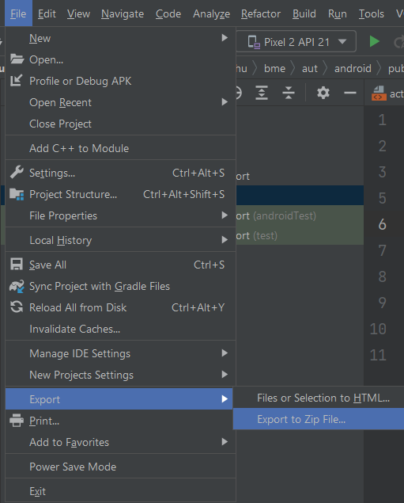

# Labor 04 - Weather Info alkalmazás készítése

## Bevezető

A labor során egy időjárás információkat megjelenítő alkalmazás elkészítése a feladat. A korábban látott UI elemek használata mellett láthatunk majd példát hálózati kommunkáció hatékony megvalósítására is a [`Retrofit`](https://square.github.io/retrofit/) library felhasználásával. A felületek közötti navigációt pedig ezúttal a [`Navigation Component`](https://developer.android.com/guide/navigation/navigation-getting-started) segítségével fugjuk megoldani.

Az alkalmazás városok listáját jeleníti meg egy [`RecyclerView`](https://developer.android.com/guide/topics/ui/layout/recyclerview)-ban, egy kiválasztott város részletes időjárás adatait pedig az [OpenWeatherMap](https://openweathermap.org/) REST API-jának segítségével kérdezi le. A részetező nézeten egy [`ViewPager`](https://developer.android.com/training/animation/screen-slide)-ben két [`Fragment`](https://developer.android.com/guide/components/fragments)-en lehet megtekinteni a részleteket. Új város hozzáadására egy  [`FloatingActionButton`](https://developer.android.com/guide/topics/ui/floating-action-button) megnyomásával van lehetőség. 

> REST = [**Re**presentational **S**tate **T**ransfer](https://en.wikipedia.org/wiki/Representational_state_transfer)

<p align="center">


</p>

Felhasznált technológiák: 

- [`Activity`](https://developer.android.com/guide/components/activities/intro-activities)
- [`Fragment`](https://developer.android.com/guide/components/fragments)
- [`RecyclerView`](https://developer.android.com/guide/topics/ui/layout/recyclerview)
- [`ViewPager`](https://developer.android.com/training/animation/screen-slide)
- [`Navigation Component`](https://developer.android.com/guide/navigation/navigation-getting-started)
- [`Retrofit`](https://square.github.io/retrofit/)
- [`Gson`](https://github.com/google/gson)
- [`Glide`](https://github.com/bumptech/glide)

## Az alkalmazás specifikációja

Az alkalmazás mindössze egy `Activity`-ből fog állni, amin majd cserélgetjük a `Fragment`eket. 

Az alkalmazás indulásakor megjelenő `Fragment` a felhasználó által felvett városok listáját jeleníti meg. Minden lista elemhez tartozik egy *Remove* gomb, aminek a megnyomására az adott város törlődik a listából. Új várost a nézet jobb alsó sarkában található `FloatingActionButton` megnyomásával lehet felvenni.

Egy városra való kattintás hatására megnyílik egy új `Fragment` két beágyazott`Fragment`-tel, amik között `ViewPager`-rel lehet váltani. Az első `Fragment` a kiválasztott város időjárásának leírását és az ahhoz tartozó ikont jeleníti meg. A második `Fragment`-en a városban mért átlagos, minimum és maximum hőmérséklet, a légnyomás és a páratartalom értéke látható.

## Értékelés

Vezetett rész (0,5 pont)
- [Projekt létrehozása](#projekt-létrehozása)
- [Városlista megvalósítása](#városlista-megvalósítása)
- [Részletező nézet létrehozása és bekötése a navigációba](#részletező-nézet-létrehozása-és-bekötése-a-navigációba)
- [Hálózati kommunikáció megvalósítása](#hálózati-kommunikáció-megvalósítása)
- [A hálózati réteg bekötése a részletező nézetbe](#a-hálózati-réteg-bekötése-a-részletező-nézetbe)

Önálló feladat (0,5 pont)
- [Város listából törlés megvalósítása](#város-listából-törlés-megvalósítása)


## Vezetett rész


### Projekt létrehozása

Első lépésként indítsuk el az Android Studio-t, majd:

1. Hozzunk létre egy új projektet, válasszuk az `Basic Activity` lehetőséget.
2. A projekt neve legyen `WeatherInfo`, a kezdő package pedig `hu.bme.aut.android.weatherinfo`
3. Nyelvnek válasszuk a *Kotlin*-t.
4. A minimum API szint legyen API21: Android 5.0.
5. Az instant app támogatást, valamint a *Use legacy android.support libraries* pontot **ne** pipáljuk be.

A létrejött projekt felépítése teljesen más, mint ha `Empty Activity`-t generálnánk:

1. Egy `Activity` és két `Fragment` generálódott.
2. Kaptunk egy `Navigation Graph`-ot a *res/navigation* mappába.
3. Felvételre kerültek a `Navigation Components`-hez szükséges függőségek.
4. Alapból bekapcsolásra került a *ViewBinding*.

Töröljük ki a `MainActivity`-ből a *FloatingActionButton*t valamint nevezzük át a létrejött fragmentjeinket `CityFragment`re és `DetailsFragment`re:
- `FirstFragment`   -> `CityFragment`
- `SecondFragment`  -> `DetailsFragment`
- `fragment_first`  -> `fragment_city`
- `fragment_second` -> `fragment_details`

Töltsük le és tömörítsük ki [az alkalmazáshoz szükséges erőforrásokat](./downloads/drawables.zip) , majd másoljuk be őket a projekt *app/src/main/res* mappájába (Studio-ban a *res* mappa kijelölése után *Ctrl+V*)!

Az alkalmazásban szükségünk lesz internet elérésre. Vegyük fel az `AndroidManifest.xml` állományban az *Internet permission*-t az `application` tagen *kívülre*:

```xml
<uses-permission android:name="android.permission.INTERNET" />
```

> Androidon API 23-tól (6.0, Marshmallow) az engedélyek két csoportba lettek osztva. A *normal* csoportba tartozó engedélyeket elég felvenni az `AndroidManifest.xml` fájlba az előbb látott módon és az alkalmazás automatikusan megkapja őket. A *dangerous* csoportba tartozó engedélyek esetén ez már nem elég. Futás időben explicit módon el kell kérni őket a felhasználótól, aki akármikor meg is tagadhatja az alkalmazástól a kért engedélyt. Az engedélyek kezeléséről bővebben a [developer.android.com](https://developer.android.com/guide/topics/permissions/overview) oldalon lehet tájékozódni

Vegyük fel az alábbi szöveges erőforrásokat a `res/values/strings.xml`-be:

```xml
<resources>
    <string name="app_name">WeatherInfo</string>
    
    <string name="action_settings">Settings</string>
    
    <string name="title_activity_city">Cities</string>
    <string name="remove">Remove</string>
    
    <string name="new_city">New city</string>
    <string name="new_city_hint">City</string>
    <string name="ok">OK</string>
    <string name="cancel">Cancel</string>
    
    <string name="title_activity_details">DetailsActivity</string>
    <string name="weather">Weather</string>
    <string name="temperature">Temperature</string>
    <string name="min_temperature">Min temperature</string>
    <string name="max_temperature">Max temperature</string>
    <string name="pressure">Pressure</string>
    <string name="humidity">Humidity</string>
    <string name="main">Main</string>
    <string name="details">Details</string>
</resources>

```

OpenWeatherMap API kulcs

Regisztráljunk saját felhasználót az [OpenWeatherMap](https://openweathermap.org/) oldalon, és hozzunk létre egy API kulcsot, aminek a segítségével ahasználhatjuk majd a szolgáltatást az alkalmazásunkban! 

1. Kattintsunk a *Sign up* gombra
2. Töltsük ki a regisztrációs formot
3. A *Company* mező értéke legyen "BME", a *Purpose* értéke legyen "Education/Science"
4. Sikeres regisztráció után az *API keys* tabon található az alapértelmezettként létrehozott API kulcs.

A kapott API kulcsra később szükségünk lesz az időjárás adatokat lekérő API hívásnál.


### Városlista megvalósítása

Valósítsuk meg az egy `RecyclerView`-ból álló, városok listáját megjelenítő `CityFragment`-et! 

A város nevére kattintva jelenik majd meg egy részletező nézet (`DetailsFragment`), ahol az időjárás információk letöltése fog történni. Új város felvételére egy `FloatingActionButton` fog szolgálni.

Egészítsük ki a `fragment_city.xml` tartalmát egy `RecyclerView`-val és egy `FloatingActionButton`nel:

```xml
<?xml version="1.0" encoding="utf-8"?>
<androidx.constraintlayout.widget.ConstraintLayout xmlns:android="http://schemas.android.com/apk/res/android"
    xmlns:app="http://schemas.android.com/apk/res-auto"
    xmlns:tools="http://schemas.android.com/tools"
    android:layout_width="match_parent"
    android:layout_height="match_parent"
    tools:context=".feature.city.CityFragment">

    <androidx.recyclerview.widget.RecyclerView
        android:id="@+id/mainRecyclerView"
        android:layout_width="0dp"
        android:layout_height="0dp"
        app:layout_behavior="@string/appbar_scrolling_view_behavior"
        app:layout_constraintBottom_toBottomOf="parent"
        app:layout_constraintEnd_toEndOf="parent"
        app:layout_constraintStart_toStartOf="parent"
        app:layout_constraintTop_toTopOf="parent"
        tools:listitem="@layout/item_city" />

    <com.google.android.material.floatingactionbutton.FloatingActionButton
        android:id="@+id/fab"
        android:layout_width="wrap_content"
        android:layout_height="wrap_content"
        android:layout_gravity="bottom|end"
        android:layout_margin="24dp"
        android:src="@drawable/ic_add_white_36dp"
        app:layout_constraintBottom_toBottomOf="parent"
        app:layout_constraintEnd_toEndOf="parent" />
</androidx.constraintlayout.widget.ConstraintLayout>
```

Az egyes funkciókhoz tartozó osztályokat külön *package*-ekbe fogjuk szervezni. Előfordulhat, hogy a másolások miatt az Android Studio nem ismeri fel egyből a package szerkezetet, így ha ilyen problémánk lenne, az osztály néven állva Alt+Enter után állítassuk be a megfelelő package nevet.

A `hu.bme.aut.android.weatherinfo` package-ben hozzunk létre egy `feature` nevű package-et. A `feature` package-ben hozzunk létre egy `city` nevű package-et. *Drag and drop* módszerrel helyezzük át a `CityFragment`-et a `city` *package*-be, a felugró dialógusban pedig kattintsunk a *Refactor* gombra.

A `CityFragment` kódját cseréljük le a következőre:

```kotlin
class CityFragment : Fragment(), CityAdapter.OnCitySelectedListener,
    AddCityDialogFragment.AddCityDialogListener {

    private var _binding: FragmentCityBinding? = null
    private val binding get() = _binding!!

    private lateinit var adapter: CityAdapter

    override fun onCreateView(
        inflater: LayoutInflater, container: ViewGroup?,
        savedInstanceState: Bundle?
    ): View? {

        _binding = FragmentCityBinding.inflate(inflater, container, false)
        return binding.root
    }

    override fun onViewCreated(view: View, savedInstanceState: Bundle?) {
        super.onViewCreated(view, savedInstanceState)
        
        initRecyclerView()
        initFab()
    }


    override fun onDestroyView() {
        super.onDestroyView()
        _binding = null
    }

    private fun initRecyclerView() {
        adapter = CityAdapter(this)
        adapter.addCity("Budapest")
        adapter.addCity("Debrecen")
        adapter.addCity("Sopron")
        adapter.addCity("Szeged")

        binding.mainRecyclerView.layoutManager = LinearLayoutManager(context)
        binding.mainRecyclerView.adapter = adapter
    }

    private fun initFab() {
        binding.fab.setOnClickListener {
            ///TODO show AddNewCityDialogFragment
        }
    }

    override fun onCitySelected(city: String?) {
        ///TODO navigate to DetailsFragment
    }

    override fun onCityAdded(city: String?) {
        adapter.addCity(city!!)
    }
}
```

A `city` package-ben hozzuk létre egy `adapter` package-et és abban egy `CityAdapter` osztályt:

```kotlin
class CityAdapter(private val listener: OnCitySelectedListener) : RecyclerView.Adapter<CityAdapter.CityViewHolder>() {
    private var cities: MutableList<String> = ArrayList()

    override fun onCreateViewHolder(parent: ViewGroup, viewType: Int) = CityViewHolder(
            ItemCityBinding.inflate(LayoutInflater.from(parent.context), parent, false)
    )

    override fun onBindViewHolder(holder: CityViewHolder, position: Int) {
        val item = cities[position]
        holder.bind(item)
    }

    override fun getItemCount(): Int = cities.size

    fun addCity(newCity: String) {
        cities.add(newCity)
        notifyItemInserted(cities.size - 1)
    }

    fun removeCity(position: Int) {
        cities.removeAt(position)
        notifyItemRemoved(position)
        if (position < cities.size) {
            notifyItemRangeChanged(position, cities.size - position)
        }
    }

    inner class CityViewHolder(val binding: ItemCityBinding) :
            RecyclerView.ViewHolder(binding.root) {
        var item: String? = null

        init {
            binding.root.setOnClickListener {
                listener.onCitySelected(item)
            }
        }

        fun bind(newCity: String?) {
            item = newCity
            binding.cityItemNameTextView.text = item
        }
    }

    interface OnCitySelectedListener {
        fun onCitySelected(city: String?)
    }

}
```

Hozzuk létre a `res/layout` mappában az  `item_city.xml` layoutot:

```xml
<?xml version="1.0" encoding="utf-8"?>
<LinearLayout xmlns:android="http://schemas.android.com/apk/res/android"
    xmlns:tools="http://schemas.android.com/tools"
    android:layout_width="match_parent"
    android:layout_height="wrap_content"
    android:orientation="horizontal"
    android:paddingBottom="8dp"
    android:paddingLeft="16dp"
    android:paddingRight="16dp"
    android:paddingTop="8dp"
    android:weightSum="3">

    <TextView
        android:id="@+id/cityItemNameTextView"
        android:layout_width="0dp"
        android:layout_height="wrap_content"
        android:layout_weight="2"
        tools:text="Budapest" />

    <Button
        android:id="@+id/cityItemRemoveButton"
        android:layout_width="0dp"
        android:layout_height="wrap_content"
        android:layout_weight="1"
        android:text="@string/remove" />

</LinearLayout>
```

A `CityFragment`tel kapcsolatos következő lépés az új város nevét bekérő dialógus (`DialogFragment`) megvalósítása és bekötése.

Hozzunk létre egy `fragment_new_city.xml` nevű layout fájlt a `res/layout` mappában a következő tartalommal:

```xml
<?xml version="1.0" encoding="utf-8"?>
<LinearLayout xmlns:android="http://schemas.android.com/apk/res/android"
    android:layout_width="match_parent"
    android:layout_height="match_parent"
    android:orientation="vertical"
    android:padding="24dp">

    <EditText
        android:id="@+id/newCityDialogEditText"
        android:layout_width="match_parent"
        android:layout_height="wrap_content"
        android:hint="@string/new_city_hint"
        android:inputType="text" />

</LinearLayout>
```

A `feature.city` package-ben hozzuk létre az `AddCityDialogFragment` osztályt:

```kotlin
class AddCityDialogFragment(
    var listener: AddCityDialogListener
) : AppCompatDialogFragment() {

    companion object {
        const val TAG = "AddCityDialogFragment"
    }

    private var _binding: FragmentNewCityBinding? = null
    private val binding get() = _binding!!

    override fun onCreateDialog(savedInstanceState: Bundle?): Dialog {
        _binding = FragmentNewCityBinding.inflate(LayoutInflater.from(context))
        return AlertDialog.Builder(requireContext())
            .setTitle(R.string.new_city)
            .setView(binding.root)
            .setPositiveButton(R.string.ok) { dialogInterface, i ->
                listener.onCityAdded(
                    binding.newCityDialogEditText.text.toString()
                )
            }
            .setNegativeButton(R.string.cancel, null)
            .create()
    }

    interface AddCityDialogListener {
        fun onCityAdded(city: String?)
    }
}
```

Végül egészítsük ki a `CityFragment` `initFab()` függvényét úgy, hogy a gombra kattintva jelenjen meg az új dialógus:

```kotlin
private fun initFab() {
    binding.fab.setOnClickListener{
        AddCityDialogFragment(this)
            .show(parentFragmentManager, AddCityDialogFragment.TAG)
    }
}
```

Indítsuk el az alkalmazást, amely már képes városnevek bekérésére és megjelenítésére.


### Részletező nézet létrehozása és bekötése a navigációba

A következő lépésben a `hu.bme.aut.android.weatherinfo.feature`  package-en belül hozzunk létre egy `details` nevű packaget.

Mozgassuk át ide a `DetailsFragmentet`.

A hozzá tartozó `fragment_details.xml` layout kódja:

```xml
<?xml version="1.0" encoding="utf-8"?>
<LinearLayout xmlns:android="http://schemas.android.com/apk/res/android"
    android:layout_width="match_parent"
    android:layout_height="match_parent"
    android:orientation="vertical"
    android:paddingBottom="@dimen/activity_vertical_margin"
    android:paddingLeft="@dimen/activity_horizontal_margin"
    android:paddingRight="@dimen/activity_horizontal_margin"
    android:paddingTop="@dimen/activity_vertical_margin">

    <com.google.android.material.tabs.TabLayout
        android:id="@+id/tabLayout"
        android:layout_width="match_parent"
        android:layout_height="wrap_content"
        android:layout_gravity="top" />

    <androidx.viewpager2.widget.ViewPager2
        android:id="@+id/mainViewPager"
        android:layout_width="match_parent"
        android:layout_height="0dp"
        android:layout_weight="1" />

</LinearLayout>
```

Hozzunk létre a hiányzó *dimen* erőforrásokat (*Alt+Enter* -> *Create dimen value...*), értékük legyen *16dp*!

A felület gyakorlatilag egy `ViewPager`-t tartalmaz, melyben két `Fragment`-et fogunk megjeleníteni. A `PagerTabStrip` biztosítja a *Tab* jellegű fejlécet.

A `DetailsFragment.kt`-t helyezzük át a `feature.details` *package*-be, és a kódja legyen a következő:

```kotlin
class DetailsFragment : Fragment() {

    companion object {
        private const val TAG = "DetailsFragment"
    }

    private var _binding: FragmentDetailsBinding? = null
    private val binding get() = _binding!!

    private var city :String? = null

    override fun onCreateView(
        inflater: LayoutInflater, container: ViewGroup?,
        savedInstanceState: Bundle?
    ): View? {

        _binding = FragmentDetailsBinding.inflate(inflater, container, false)
        return binding.root

    }

    override fun onViewCreated(view: View, savedInstanceState: Bundle?) {
        super.onViewCreated(view, savedInstanceState)

        city = DetailsFragmentArgs.fromBundle(requireArguments()).city

        (activity as MainActivity).supportActionBar!!.title = getString(R.string.weather, city)
        (activity as MainActivity).supportActionBar!!.setDisplayHomeAsUpEnabled(true)
    }


    override fun onDestroyView() {
        super.onDestroyView()
        _binding = null
    }
}
```

Cseréljük le a `strings.xml`-ben a *weather* szöveges erőforrást:

```xml
<string name="weather">Weather in %s </string>
```

A string erőforrásba írt *%s* jelölő használatával lehetővé válik egy *String argumentum* beillesztése a stringbe, ahogy a fenti kódrészletben láthatjuk.

### A navigáció alapjai

> Korábban a navigációt körülményesebben kellett megoldanunk. Ha új Activity komponensre szerettünk volna
navigálni, akkor egy Intentet kellett létrehozni, és elküldeni. Ha viszont Fragmenteket használtunk,
azokat kellett az Activity-n belül lecserélni. A navigáció tehát nem volt túl egységes, ráadásul a
navigáció nem volt egységes helyre kiszervezve, nem tudtuk könnyen átlátni az appon belüli navigációs
folyamatot, csak ha kikerestük a kódban ezeket a részeket. A Jetpack Navigation Component egy egységes
navigációs megoldást nyújt az app számára. Bevezette a navigációs gráfot, mint új erőforrás-típust.
Ebben deklaratívan írhatjuk le az egyes navigációs célpontokat, ezek lehetnek Activity-k és
Fragmentek is. A célpontok közé akciókat vehetünk fel, ezek képezik az átmenetet két célpont között.
A célpontok pedig paramétereket is kaphatnak, pl. egy részletező nézet megkaphatja annak az entitásnak
a kulcsát, amelynek a részleteit meg kell mutatnia.

> A Navigation component jól támogatja a "Single Activity" architekturális elvet is. Eredetileg csak az
Activity volt a felhasználói felülettel rendelkező komponens, de a Fragmentek megjelenése óta
feleslegessé vált minden felületnek külön Activity-t létrehoznunk. Ráadásul az Activity-váltás a
rendszeren keresztül történik, ezért lassú, és az Activity-k általában véve több is több erőforrást
igényelnek az operációs rendszertől. Az Activity-n belüli Fragmentek lecserélése nem ilyen lassú
és költséges. Ráadásul a modern alkalmazásokban több képernyőn keresztül is azonos menürendszer, pl.
Navigation Drawer jelenik meg a felületen, ez is a Fragmentek használatát indokolja. A
Navigation Component célpontjai Fragmentek is lehetnek, ezért az alkalmazást könnyen meg tudjuk
valósítani akár egy Activity-vel is.

> Ahhoz, hogy az új navigációt az alkalmazásban használjuk, először néhány függőséget kell felvennünk a projektszintű `build.gradle` fájl elejére:

```gradle
buildscript {
    dependencies {
        def nav_version = "2.4.1"
        classpath "androidx.navigation:navigation-safe-args-gradle-plugin:$nav_version"
    }
}
```

> Ezzel egy új gradle plugint veszünk fel, ez azért szükséges, mert a Navigation component
kódgenerálást is használ, és az alkalmazás buildelése során a generált kódnak is létre kell jönnie.
> Ezután a modulszintű `build.gradle` fájlban kell alkalmazni az imént felvett safe-args plugint:

```gradle
plugins {
    ...
    id 'androidx.navigation.safeargs.kotlin'
}
```

> Majd a dependencies részben kell felvenni a további szükséges függőségeket:

```gradle
    def nav_version = "2.4.1"
    implementation "androidx.navigation:navigation-fragment-ktx:$nav_version"
    implementation "androidx.navigation:navigation-ui-ktx:$nav_version"
    implementation "androidx.navigation:navigation-dynamic-features-fragment:$nav_version"
```

> Szükségünk van még egy navigációs erőforrásra is: `res/nav_graph.xml`. Ebben kell leírni a felületek közötti navigációt.

Valósítsuk meg azt, hogy egy városnév kiválasztásakor megfelelően átnavigáljunk a `DetailsFragment`-re. A Fragmentek közötti navigációt a *Navigation Components* segítségével fogjuk megoldani. Nyissuk meg a `nav_graph.xml`-t, és töröljük ki a tartalmát.
Ez után vagyük fel a `cityFragment`-et és a `detailsFragment`-et majd adjunk egy *actiont* a `cityFragment` és a `detailsFragment` közé. A város neve attribútumként fog átadásra kerülni a két *Fragment* között, így ezt is vegyük fel. Az előálló `nav_graph.xml`:

```xml
<?xml version="1.0" encoding="utf-8"?>
<navigation xmlns:android="http://schemas.android.com/apk/res/android"
    xmlns:app="http://schemas.android.com/apk/res-auto"
    xmlns:tools="http://schemas.android.com/tools"
    android:id="@+id/nav_graph"
    app:startDestination="@id/cityFragment">
    <fragment
        android:id="@+id/cityFragment"
        android:name="hu.bme.aut.android.weatherinfo.feature.city.CityFragment"
        android:label="fragment_city"
        tools:layout="@layout/fragment_city">
        <action
            android:id="@+id/action_cityFragment_to_detailsFragment"
            app:destination="@id/detailsFragment" />
    </fragment>
    <fragment
        android:id="@+id/detailsFragment"
        android:name="hu.bme.aut.android.weatherinfo.feature.details.DetailsFragment"
        android:label="DetailsFragment"
        tools:layout="@layout/fragment_details">
        <argument
            android:name="city"
            app:argType="string"
            app:nullable="true" />
    </fragment>
</navigation>
```

Ezek után a `CityFragment` `onCitySelected()` függvényében át kell navigálni a `DetailsFragment`re a megfelelő argumentummal:

```kotlin
override fun onCitySelected(city: String?) {
    findNavController().navigate(
        CityFragmentDirections.actionCityFragmentToDetailsFragment(city!!)
    )
}
``` 

Próbáljuk ki az alkalmazást, kattintsunk egy város nevére!

### Hálózati kommunikáció megvalósítása

Az *app* modulhoz tartozó `build.gradle` fájlban a `dependencies` blokkhoz adjuk hozzá a `Retrofit` és `Glide` libraryket:

```groovy
dependencies{
    //...
    def retrofit_version = "2.9.0"
    implementation "com.squareup.retrofit2:retrofit:$retrofit_version"
    implementation "com.squareup.retrofit2:converter-gson:$retrofit_version"

    def glide_version = "4.13.0"
    implementation "com.github.bumptech.glide:glide:$glide_version"
    annotationProcessor "com.github.bumptech.glide:compiler:$glide_version"
}
```

Ezután kattintsunk a jobb felső sarokban megjelenő **Sync now** gombra.

>  A `Retrofit` a fejlesztő által leírt egyszerű, megfelelően annotált interfészek alapján kódgenerálással állít elő HTTP hívásokat lebonyolító implementációt. Kezeli az URL-ben inline módon adott paramétereket, az URL queryket, stb. Támogatja a legnépszerűbb szerializáló/deszerializáló megoldásokat is (pl.: [`Gson`](https://github.com/google/gson), [`Moshi`](https://github.com/square/moshi), [`Simple XML`](simple.sourceforge.net), stb.), amikkel Java objektumok, és JSON vagy XML formátumú adatok közötti kétirányú átalakítás valósítható meg. A laboron ezek közül a Gsont fogjuk használni a JSON-ban érkező időjárás adatok konvertálására.

> A `Glide`  egy hatékny képbetöltést és -cahce-elést megvalósító library Androidra. Egyszerű interfésze és hatékonysága miatt használjuk.


Modell osztályok létrehozása 

A modell osztályok számára a `hu.bme.aut.android.weatherinfo` package-ben hozzunk létre új package-et `model` néven. 

A `model` package-ben hozzunk létre egy új osztályt `WeatherData` néven:

```kotlin
class WeatherData {
    var weather: List<Weather>? = null
    var main: MainWeatherData? = null
    var wind: Wind? = null
} 
```

 Az időjárás szolgáltatástól kapott *JSON* válasz alapján egy ilyen `WeatherData` példány fog létrejönni a `Retrofit` és a `Gson` együttműködésének köszönhetően.

A `model` package-ben hozzuk létre a `Weather` osztályt:

```kotlin
class Weather {
    var id: Long = 0
    var main: String? = null
    var description: String? = null
    var icon: String? = null
}
```

Szintén a `model` package-ben hozzuk létre a `MainWeatherData` osztályt:

```kotlin
class MainWeatherData {
    var temp: Float = 0f
    var pressure: Float = 0f
    var humidity: Float = 0f
    var temp_min: Float = 0f
    var temp_max: Float = 0f
}
```

Végül hozzuk létre a `Wind` osztályt is:

```kotlin
class Wind {
    var speed = 0f
    var deg = 0f
}
```

A `details` *package*-ben hozzuk létre a `WeatherDataHolder` interfészt:

```kotlin
interface WeatherDataHolder {
    fun getWeatherData(): WeatherData?
} 
```

 A `WeatherDataHolder`-en keresztül fogják lekérni a `Fragment`-ek a tartalmazó `Fragment`-től az időjárás adatokat.

Vegyünk fel egy `WeatherData` típusú tagváltozót a `DetailsFragment`-be:

```kotlin
private var weatherData: WeatherData? = null 
```

Módosítsuk úgy a `DetailsFragment`-et, hogy implementálja a `WeatherDataHolder` interfészt:

```kotlin
class DetailsFragment : Fragment(), WeatherDataHolder {
```

Implementáljuk a szükséges függvényt:

```kotlin
override fun getWeatherData(): WeatherData? = weatherData 
```

A használt `weatherData` változónak fogunk később értéket adni, amikor visszaérkezett az értéke a hálózati hívás eredményeként. A `ViewPager` két lapján levő `Fragment`-ek a `WeatherDataHolder` interfészen keresztül fogják lekérni az `DetailsFragment`-től a `weatherData` objekutmot a megjelenítéshez.

A hálózati réteg megvalósítása

A `hu.bme.aut.android.weatherinfo` package-ben hozzuk létre egy `network` nevű package-et, amely a hálózati kommunikációhoz kapcsolódó osztályokat fogja tartalmazni. 

A `network` package-en belül hozzuk létre egy `WeatherApi` nevű interfészt. 

```kotlin
interface WeatherApi {

    @GET("/data/2.5/weather")
    fun getWeather(
        @Query("q") cityName: String?,
        @Query("units") units: String?,
        @Query("appid") appId: String?
    ): Call<WeatherData?>?
}
```

Látható, hogy *annotációk* alkalmazásával tuduk jelezni, hogy az adott függvényhívás milyen hálózati hívásnak fog megfelelni. A `@GET` annotáció *HTTP GET* kérést jelent, a paraméterként adott string pedig azt jelzi, hogy hogy a szerver alap *URL*-éhez képest melyik végpontra szeretnénk küldeni a kérést.

> Hasonló módon tudjuk leírni a többi HTTP kérés típust is: @POST, @UPDATE, @PATCH, @DELETE

A függvény paremétereit a `@Query` annotációval láttuk el. Ez azt jelenti, hogy a `Retrofit` az adott paraméter értékét a kéréshez fűzi *query paraméterként* az annotációban megadott kulccsal.

> További említésre méltó annotációk a teljesség igénye nélkül: @HEAD, @Multipart, @Field

A hálózati hívást jelölő interfész függvény visszatérési értéke egy`Call<WeatherData>` típusú objektum lesz. Ez egy olyan hálózati hívást ír le, aminek a válasza `WeatherData` típusú objektummá alakítható.

Hozzunk létre a `network` package-ben egy `NetworkManager` osztályt:

```kotlin
object NetworkManager {
    private val retrofit: Retrofit
    private val weatherApi: WeatherApi

    private const val SERVICE_URL = "https://api.openweathermap.org" 
    private const val APP_ID = "APP_ID"

    init {
        retrofit = Retrofit.Builder()
            .baseUrl(SERVICE_URL)
            .client(OkHttpClient.Builder().build())
            .addConverterFactory(GsonConverterFactory.create())
            .build()
        weatherApi = retrofit.create(WeatherApi::class.java)
    }

    fun getWeather(city: String?): Call<WeatherData?>? {
        return weatherApi.getWeather(city, "metric", APP_ID)
    }
}
```

Ez az osztály lesz felelős a hálózati kérések lebonyolításáért. Egyetlen példányra lesz szükségünk belőle, így [singleton](https://en.wikipedia.org/wiki/Singleton_pattern)ként implementáltuk. Konstansokban tároljuk a szerver alap címét, valamint a szolgáltatás használatához szükséges API kulcsot.

A `Retrofit.Builder()` hívással kérhetünk egy pareméterehzető `Builder` példányt. Ebben adhatjuk meg a hálózati hívásaink tulajdonságait. Jelen példában beállítjuk az elérni kívánt szolgáltatás címét, a HTTP kliens implementációt ([OkHttp](http://square.github.io/okhttp/)), valamint a JSON és objektum reprezentációk közötti konvertert (Gson).

A `WeatherApi` interfészből a `Builder`-rel létrehozott `Retrofit` példány segítségével tudjuk elkérni a fordítási időben generált, paraméterezett implementációt.

 A `retrofit.create(WeatherApi.class)` hívás eredményeként kapott objektum megvalósítja a `WeatherApi` interfészt.  Ha ezen az objektumon meghívjuk a `getWeather(...)` függvényt, akkor megtörténik az általunk az interfészben definiált hálózati hívás. 

Az `APP_ID` paramétert elfedjük az időjárást lekérdező osztályok elől, ezért a `NetworkManager` is tartalmaz egy `getWeather(...)` függvényt, ami a `WeatherApi` implementációba hív tovább.

**Cseréljük le** az `APP_ID` értékét az [OpenWeatherMap](https://openweathermap.org/) oldalon kapott saját API kulcsunkra!

### A hálózati réteg bekötése a részletező nézetbe

A modell elemek és a hálózati réteg megvalósítása után a részletező nézetet fogjuk a specifikációnak megfelelően implementálni, majd bekötjük a hálózati réteget is.

A részletező nézetek továbbfejlesztése

A `ViewPager` megfelelő működéséhez létre kell hoznunk egy `FragmentStateAdapter`-ből származó osztályt a `details.adapter` *package*-ben (hozzunk létre egy `adapter` package-et), ami az eddig látott adapterekhez hasonlóan azt határozza meg, hogy milyen elemek jelenjenek meg a hozzájuk tartozó nézeten (jelen esetben az elemek `Fragment`-ek lesznek):

```kotlin
class DetailsPagerAdapter(fragment: Fragment): FragmentStateAdapter(fragment) {

    companion object{
        private const val NUM_PAGES: Int = 2
    }

    override fun getItemCount(): Int = NUM_PAGES

    override fun createFragment(position: Int): Fragment {
        return when(position){
            0 -> DetailsMainFragment()
            1 -> DetailsMoreFragment()
            else -> DetailsMainFragment()
        }
    }
}
```

Implementáljuk a hiányzó `Fragment`-eket a hozzájuk tartozó néztekkel együtt:


`res/layout/fragment_main_details.xml`:

```xml
<?xml version="1.0" encoding="utf-8"?>
<LinearLayout
    xmlns:android="http://schemas.android.com/apk/res/android"
    xmlns:tools="http://schemas.android.com/tools"
    android:layout_width="match_parent"
    android:layout_height="match_parent"
    android:orientation="vertical"
    android:padding="16dp">

    <TextView
        android:id="@+id/tvMain"
        android:layout_width="match_parent"
        android:layout_height="wrap_content"
        tools:text="Clear"/>

    <TextView
        android:id="@+id/tvDescription"
        android:layout_width="match_parent"
        android:layout_height="wrap_content"
        android:layout_marginTop="16dp"
        tools:text="Clear sky"/>

    <ImageView
        android:id="@+id/ivIcon"
        android:layout_width="match_parent"
        android:layout_height="match_parent"
        android:layout_marginTop="16dp"/>

</LinearLayout>
```

A `details.fragments` package-ben a `DetailsMainFragment`:

```kotlin
class DetailsMainFragment : Fragment() {

    private var _binding: FragmentMainDetailsBinding? = null
    private val binding get() = _binding!!

    private var weatherDataHolder: WeatherDataHolder? = null

    override fun onCreate(savedInstanceState: Bundle?) {
        super.onCreate(savedInstanceState)
        weatherDataHolder = if (parentFragment is WeatherDataHolder) {
            parentFragment as WeatherDataHolder?
        } else {
            throw RuntimeException(
                "Activity must implement WeatherDataHolder interface!"
            )
        }
    }

    override fun onCreateView(
        inflater: LayoutInflater, container: ViewGroup?,
        savedInstanceState: Bundle?
    ): View {
        _binding = FragmentMainDetailsBinding.inflate(LayoutInflater.from(context))
        return binding.root
    }

    override fun onViewCreated(view: View, savedInstanceState: Bundle?) {
        super.onViewCreated(view, savedInstanceState)

        if (weatherDataHolder!!.getWeatherData() != null) {
            displayWeatherData()
        }
    }

    private fun displayWeatherData() {
        val weather = weatherDataHolder!!.getWeatherData()?.weather!![0]
        binding.tvMain!!.text = weather.main
        binding.tvDescription!!.text = weather.description
        Glide.with(this)
            .load("https://openweathermap.org/img/w/" + weather.icon + ".png")
            .transition(DrawableTransitionOptions().crossFade())
            .into(binding.ivIcon)
    }
}
```

Figyeljük meg, hogy hogy használjuk a kódban a `Glide` libraryt!

> Az *OpenWeatherMap* API-tól a képek lekérhetők a visszakapott adatok alapján, pl: [https://openweathermap.org/img/w/10d.png](http://openweathermap.org/img/w/10d.png) 

`DetailsMoreFragment.kt`

`res/layout/fragment_more_details.xml`:

```xml
<?xml version="1.0" encoding="utf-8"?>
<TableLayout
    xmlns:android="http://schemas.android.com/apk/res/android"
    xmlns:tools="http://schemas.android.com/tools"
    android:layout_width="match_parent"
    android:layout_height="wrap_content"
    android:padding="16dp"
    android:stretchColumns="0">
    <TableRow>
        <TextView
            android:layout_width="wrap_content"
            android:layout_height="wrap_content"
            android:text="@string/temperature"/>
        <TextView
            android:id="@+id/tvTemperature"
            android:layout_width="wrap_content"
            android:layout_height="wrap_content"
            tools:text="25 °C"/>
    </TableRow>
    <TableRow>
        <TextView
            android:layout_width="wrap_content"
            android:layout_height="wrap_content"
            android:text="@string/min_temperature"/>
        <TextView
            android:id="@+id/tvMinTemp"
            android:layout_width="wrap_content"
            android:layout_height="wrap_content"
            tools:text="24 °C"/>
    </TableRow>
    <TableRow>
        <TextView
            android:layout_width="wrap_content"
            android:layout_height="wrap_content"
            android:text="@string/max_temperature"/>
        <TextView
            android:id="@+id/tvMaxTemp"
            android:layout_width="wrap_content"
            android:layout_height="wrap_content"
            tools:text="26 °C"/>
    </TableRow>
    <TableRow>
        <TextView
            android:layout_width="wrap_content"
            android:layout_height="wrap_content"
            android:text="@string/pressure"/>
        <TextView
            android:id="@+id/tvPressure"
            android:layout_width="wrap_content"
            android:layout_height="wrap_content"
            tools:text="100 Pa"/>
    </TableRow>
    <TableRow>
        <TextView
            android:layout_width="wrap_content"
            android:layout_height="wrap_content"
            android:text="@string/humidity"/>
        <TextView
            android:id="@+id/tvHumidity"
            android:layout_width="wrap_content"
            android:layout_height="wrap_content"
            tools:text="50 %"/>
    </TableRow>
</TableLayout>
```

A `details.fragment` package-ben a `DetailsMoreFragment`:

```kotlin
class DetailsMoreFragment : Fragment() {

    private var _binding: FragmentMoreDetailsBinding? = null
    private val binding get() = _binding!!

    private var weatherDataHolder: WeatherDataHolder? = null

    override fun onCreate(savedInstanceState: Bundle?) {
        super.onCreate(savedInstanceState)
        weatherDataHolder = if (parentFragment is WeatherDataHolder) {
            parentFragment as WeatherDataHolder?
        } else {
            throw RuntimeException("Activity must implement WeatherDataHolder interface!")
        }
    }

    override fun onCreateView(
        inflater: LayoutInflater,
        container: ViewGroup?,
        savedInstanceState: Bundle?
    ): View? {
        _binding = FragmentMoreDetailsBinding.inflate(LayoutInflater.from(context))
        return binding.root
    }

    override fun onViewCreated(view: View, savedInstanceState: Bundle?) {
        super.onViewCreated(view, savedInstanceState)
        if (weatherDataHolder!!.getWeatherData() != null) {
            showWeatherData()
        }
    }

    private fun showWeatherData() {
        val weatherData = weatherDataHolder!!.getWeatherData()
        binding.tvTemperature!!.text = "" + weatherData?.main!!.temp
        binding.tvMinTemp!!.text = "" + weatherData?.main!!.temp_min
        binding.tvMaxTemp!!.text = "" + weatherData?.main!!.temp_max
        binding.tvPressure!!.text = "" + weatherData?.main!!.pressure
        binding.tvHumidity!!.text = "" + weatherData?.main!!.humidity
    }
}
```

Figyeljük meg, hogyan ellenőrzi a `DetailsMainFragment` és a `DetailsMoreFragment` azt, hogy a tartalmazó `Fragment` implementálja-e a `WeatherDataHolder` interfészt. Fontos, hogy ezt a két `Fragment` majd csak azután kerül a `DetailsFragment`-re a `ViewPager`-en keresztül, amikor az adatokat lekérő hálózati kérés már adott vissza eredményt.

Ideiglenesen a `DetailsFragment` `onResume()` függvénye legyen az alábbi:

```kotlin
override fun onResume() {
    super.onResume()

    val detailsPagerAdapter =
            DetailsPagerAdapter(this)
    binding.mainViewPager.adapter = detailsPagerAdapter

    TabLayoutMediator(binding.tabLayout, binding.mainViewPager) { tab, position ->
        tab.text = when(position) {
            0 -> getString(R.string.main)
            1 -> getString(R.string.details)
            else -> ""
        }
    }.attach()
}
```

Próbáljuk ki az alkalmazást, kattintsunk egy városra! jelenleg még nem jelennek meg valós adatok, mivel még nem kötöttük be a az adatok lekéréséért felelős hívást.

### Hálózati hívás bekötése

Az időjárás adatok lekérdezésének bekötéséhez implementáljunk egy `loadWeatherData()` nevű függvényt a `DetailsFragment`-ben:

`(amennyiben a Callback-et nem ismerné fel a studio, Alt+Enter után importáljuk a retrofit2-es megoldást)`

```kotlin
private fun loadWeatherData(){
    NetworkManager.getWeather(city)!!.enqueue(object : Callback<WeatherData?> {

        override fun onResponse(
            call: Call<WeatherData?>,
            response: Response<WeatherData?>
        ) {
            Log.d(TAG, "onResponse: " + response.code())
            if (response.isSuccessful) {
                displayWeatherData(response.body())
            } else {
                Toast.makeText(
                    activity,
                    "Error: " + response.message(),
                    Toast.LENGTH_SHORT
                ).show()
            }
        }

        override fun onFailure(
            call: Call<WeatherData?>,
            throwable: Throwable
        ) {
            throwable.printStackTrace()
            Toast.makeText(
                activity,
                "Network request error occurred, check LOG",
                Toast.LENGTH_SHORT
            ).show()
        }
    })
}
```

Implementáljuk a hiányzó `displayWeatherData(...)` függvényt, ami sikeres API hívás esetén megjeleníti az eredményt:

```kotlin
private fun displayWeatherData(receivedWeatherData: WeatherData?) {

    weatherData = receivedWeatherData

    val detailsPagerAdapter = DetailsPagerAdapter(this)
    binding.mainViewPager.adapter = detailsPagerAdapter
}
```

A `DetailsActivity` `onResume()` függvényében hívjuk meg a `loadWeatherData()` függvényt:

```kotlin
override fun onResume() {
    super.onResume() 
	... 
	loadWeatherData()
}
```

Futtassuk az alkalmazást és figyeljük meg a működését! Próbáljuk ki azt is, hogy mi történik akkor, ha megszakítjuk a futtató eszköz internet kapcsolatát és megpróbáljuk megnyitni a részletező nézetet!

## Önálló feladat

### Város listából törlés megvalósítása

Valósítsuk meg a városok törlését a *Remove* gomb megnyomásának hatására.

## Feltöltendő állományok

A labor értékeléséhez **két külön** fájlt kell feltölteni:

1. Az elkészült forráskódot egy .zip-ben. Ez generálható az Android Studioval a `File` > `Export` > `Export to Zip File...` menüponttal.

<p align="center"> 

</p>

2. Egy pdf-et, amiben a név, neptun kód és az alábbi képernyőképek szerepelnek (az emulátor, és egy lényegesebb kódrészlet is):

	1. CityFragment (ha kész az önálló rész, a háttérben a CityAdapter megfelelő részével)
	2. AddCityDialogFragment
	3. DetailsMainFragment (egy újonnan felvett város adataival)
	4. DetailsMoreFragment (egy újonnan felvett város adataival)

<p align="center"> 

</p>


