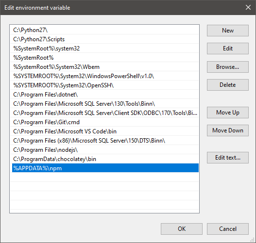
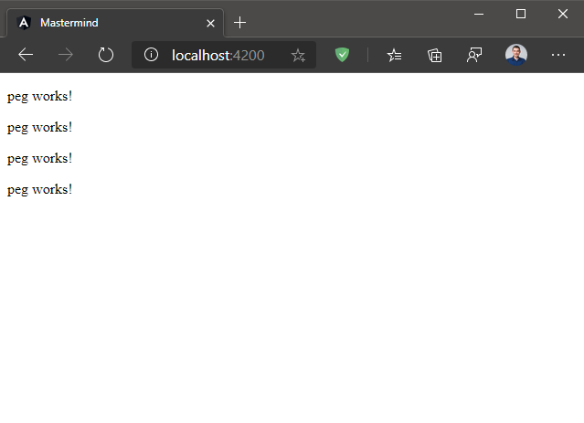

# Labor 05 - Angular bevezető

## Bevezetés

A labor folyamán a hallgatók jelen anyag segítségével önállóan végeznek feladatokat a webes technológiák gyakorlati megismerése érdekében. Az előző webes laborok ismereteinek megszerzése jelen labor elvégzéséhez erősen ajánlott.

<details>
<summary>
Mivel a labor önállóan elvégzendő, ezért a kódrészletek, feladatok egy része kinyitható blokkokba került az alábbihoz hasonlóan, hogy a feladatot teljesen önállóan is meg lehessen oldani. Klikk!
</summary>

`spoiler.ts`
``` TS
export class Spoiler {
  text = "spoiler!";
}
```

A megoldásodat mindig ellenőrizd, és lehetőleg ne térj el lényegében a mintamegoldástól!
</details>

<br/>

<details>
<summary>Ez a dokumentum egyedi stíluslapot tartalmaz.</summary>

GitHubon az alábbi CSS nyers szövegként jelenik meg, GitHub Pages oldalakon viszont értelmezésre kerül (tehát kiértékelődik), ezért a nyers szöveg nem látható.

<style>
details {
  padding-left: 1em;
  border: 1px solid;
  background: #7773;
  margin-bottom: 0.5em;
}
details summary {
  font-size: 1.2em;
  cursor: pointer;
  color: #69f;
}
details summary:hover {
  color: #58a;
}
</style>

</details>

Felhasznált technológiák és eszközök:

- webböngészők beépített hibakereső eszközei,
  - javasolt az [új Microsoft Edge](https://www.microsoft.com/en-us/edge) vagy a [Google Chrome](https://www.google.com/chrome/) böngésző használata,

- npm, a [NodeJS](https://nodejs.org/en/download/) csomagkezelője,
  - a laborhoz használható mind a Current, mind az LTS verzió, de ha még nem telepítetted a NodeJS-t, akkor érdemes a Currentet telepíteni (ha korábbi verzió van telepítve, akkor pedig a Currentre frissíteni),

- [Visual Studio Code](https://code.visualstudio.com/download) kódszerkesztő alkalmazás,
  - otthoni vagy egyéni munkavégzéshez használható bármilyen más kódszerkesztő vagy fejlesztőkörnyezet, de a környezet kapcsán felmerülő eltérésekről önállóan kell gondoskodni,
  - javasolt bővítmények:
    - [Angular Language Service](https://marketplace.visualstudio.com/items?itemName=Angular.ng-template) segítségével még a HTML kódban is kapunk fordítási elemzést és kódkiegészítést,
    - [Angular Essentials](https://marketplace.visualstudio.com/items?itemName=johnpapa.angular-essentials): [John Papa](https://johnpapa.net/) által összeállított Angular bővítmény pakk (tartalmazza a fenti Angular Language Service-t is).
    - Javasolt feltelepíteni a böngészőnknek megfelelő bővítményt VS Code-hez, amivel debugolni tudunk:
      - [Debugger for Microsoft Edge](https://marketplace.visualstudio.com/items?itemName=msjsdiag.debugger-for-edge)
      - [Debugger for Chrome](https://marketplace.visualstudio.com/items?itemName=msjsdiag.debugger-for-chrome)
      - [Debugger for Firefox](https://marketplace.visualstudio.com/items?itemName=firefox-devtools.vscode-firefox-debug)

Ahol nincs külön kifejezetten jelölve, a szoftverek legfrissebb stabil verzióit érdemes használni. Ha már van telepítve korábbról globális csomag, pl. az Angular CLI, akkor azokat érdemes frissíteni a legfrissebb verziókra.

> *Figyelem!* Az Angular laborok során számos, viszonylag nagyméretű (többszáz megabájt) függőségi csomag letöltésére lesz szükség (az `npm install` parancs hatására), de ha valaki már sikeresen telepítette a korábbi labor során az NPM csomagokat, akkor azokat várhatóan nem kell újra letölteni.

### Az Angular-ről dióhéjban

Érdemes bevezetőként megnézni a hivatalos dokumentáció áttekintő oldalát: [https://angular.io/guide/architecture](https://angular.io/guide/architecture).


Az [Angular](https://angular.io/) egy komplett alkalmazásfejlesztési keretrendszer, aminek segítségével böngészőben futtatható, JavaScript alapú kliensalkalmazásokat tudunk írni. Az legfontosabb kulcsgondalatai:
- [Komponensek](https://angular.io/guide/architecture-components): az alkalmazás egymásba ágyazható elemei, amik egy adott felületi elem (oldal, menü, gomb stb.) kirajzolásáért és adatkötéséért felelősek.
- [Adatkötés](https://angular.io/guide/displaying-data): az adatkötés az adat felületre történő kirajzolását, a felületről beérkező (felhasználói) események kezelését, illetve ezek kombinációját (kétirányú adatkötés) jelenti.
- [Szolgáltatások](https://angular.io/guide/architecture-services): az alkalmazásunkban konkrét részfunkcionalitásért felelős osztályok, amelyeket [Dependency Injection](https://angular.io/guide/dependency-injection) támogat.
- [Modulok](https://angular.io/guide/architecture-modules): az alkalmazásunk összefüggő komponensei, szolgáltatásai (, direktívái, csővezetékei, routerei stb.), amelyek egységesen importálhatók más modulokba.
  - Maga az Angular is moduláris, a keretrendszer különböző funkcióit a megfelelő modulok, azokból komponensek, szolgáltatások (stb.) importálásával tudjuk elérni, ehhez a TypeScript (JavaScript) `import` kulcsszavát fogjuk használni, pl. `import { AppModule } from './app/app.module'; ` vagy `import { NgModule } from '@angular/core';`.
- [Sablonozónyelv (template syntax)](https://angular.io/guide/template-syntax): az Angular saját "nyelve", ami HTML és TypeScript elemeket, valamint néhány egyedi szintaktikai elemet tartalmaz.
- Sablonok: az Angular komponensek egy mögöttes, logikát és struktúrát leíró TypeScript fájlból és általában egy ehhez tartozó HTML fájlból tevődnek össze. A HTML fájl a mögöttes TypeScript fájlban definiált komponenshez fog adatot és eseményt kötni.
- [Angular CLI](https://angular.io/cli): az Angular Command Line Interface (CLI) egy [npm](https://www.npmjs.com/get-npm)-ből telepíthető parancssori eszköz, aminek segítségével összeállíthatjuk a kiinduló projektünket, új fájlokat, komponenseket hozhatunk létre előre összeállított formában.
- Dekorátorok: a TypeScript [dekorátorai](https://www.typescriptlang.org/docs/handbook/decorators.html#class-decorators) segítségével az Angular osztályainkhoz, tulajdonságokhoz metaadatokat rendelünk az alábbi formában:
``` TS
import { Component } from '@angular/core';

@Component({
  selector: 'app-root',
  templateUrl: './app.component.html',
  styleUrls: ['./app.component.scss']
})
export class AppComponent {
  /* ... */
}

```

# A feladat

A feladat a klasszikus [MasterMind](https://en.wikipedia.org/wiki/Mastermind_(board_game)) táblajáték kliensalkalmazás elkészítése lesz. Ennek sok variánsa létezik, a játék szabályai nálunk az alábbiak lesznek:
- A "gép" (a kódmester) sorsol egy véletlenszerű, 4 hosszúságú sorozatot az alábbi 6 színű golyóból: piros, lila, kék, zöld, sárga, narancs.
  - Ugyanaz a szín többször is szerepelhet a sorrendben, pl.: kék, sárga, sárga, kék, zöld, lila.
- A játékos (a kódfejtő) megpróbálja megtippelni a kódmester által kisorsolt színsorozatot. Minden tippre a játékos visszajelzést kap: 
  - annyi **fekete** színű jelzést kap a játékos, ahány helyen **eltalálta** a kisorsolt elemet,
  - annyi **fehér** színű jelzést kap *ezeken felül*, ahány szín **helyes, de rossz helyen van** a sorrendben.
- A játékosnak 10 körön belül ki kell találnia az eredeti sorrendet.

A labor során a játék kezdőképernyőjét készítjük el, a következő alkalommal innen folytatjuk, ezért a végállapotot érdemes elmenteni!

<h1 id="kiindulas">Kiindulás</h1>

A gépre telepítve kell lennie az Angular CLI eszköznek. Az Angular CLI egy npm parancssori parancs, a NodeJS telepítésekor a globálisan telepített eszközök így bekerülnek a PATH változóba, így parancssorból egyszerűen az `ng` parancs futtatásával érhető el, ezért javasolt globálisan telepíteni az eszközt. Nyissunk meg egy üres munkamappát `mastermind` néven (ahol dolgozni szeretnénk, laborban pedig a laborvezető által meghatározott útvonalon) VS Code-ban, majd a Terminalban (`Ctrl+ö`) adjuk ki az alábbi parancsot:

> `npm install -g @angular/cli`

Az esetleges warningokat (WARN) figyelmen kívül hagyhatjuk, csak az error jelzésű sorok jeleznek hibát.

A telepítő felteheti az alábbi kérdést, erre válaszoljunk `n`-nel:
> Would you like to share anonymous usage data with the Angular Team at Google under Google’s Privacy Policy at https://policies.google.com/privacy? For more details and how to change this setting, see http://angular.io/analytics.

Ezután az aktuális munkamappánkban adjuk ki az alábbi parancsot, ami egy új, üres projektet hoz nekünk létre a jelenlegi útvonalon:

> `ng.cmd new mastermind --prefix=mm --skip-tests=true --routing=false --style=scss --inline-style=false --inline-template=false --directory=.`

> *Tipp:* ha valaki járatos a PowerShell világában, akkor érdemes tisztában lenni vele, hogy a globális `ng` parancs futtatása PowerShellből a PATH-ban található `ng.ps1` PowerShell scriptet preferálja az `ng.cmd` helyett. Mivel a PS1 szkript nem digitálisan aláírt, ezért nem futtatható anélkül, hogy a felhasználó ehhez kifejezetten hozzá ne járulna. Az aláíratlan PowerShell szkriptek futtatása veszélyes lehet, ezért csak akkor engedélyezzük az aláíratlan szkript futtatását, ha tudjuk, mit csinálunk (vagy kontrollált környezetben, pl. konténerben vagy virtuális gépen futunk, amit nem zavar, ha tönkretesztünk). Az aláíratlan szkriptek engedélyezéséhez lásd a [hivatalos leírást](https:/go.microsoft.com/fwlink/?LinkID=135170). Más operációs rendszereken vagy más shell használatával (pl. bash) az ng parancs meghívásának szintaxisa változhat (pl. `ng`, `ng.cmd` vagy `ng.ps1`)
>
> ***FONTOS:*** a fentiek tükrében a későbbiekben futtatandó parancsokban értelemszerűen használjuk az `ng` parancs helyett az `ng.cmd`-t, ha szükséges.

A parancs futtatásakor az eszköz megválaszolandó kérdéseket tehet fel, pl. azzal kapcsolatban, hogy engedélyezzük-e a [strict](https://angular.io/guide/strict-mode) módo(ka)t. Itt döntsünk megértésünk, belátásunk, bátorságunk és ismereteink függvényében.

A parancshoz kapcsolódó kapcsolók értelmezéséhez a [dokumentáció](https://angular.io/cli/new) ad segítséget. Kiemelendő a `prefix` kapcsoló, amivel az automatikusan generált komponensek CSS selectorainak prefixét adjuk meg. Ez alapértelmezetten az `app` értéket veszi fel, tehát a KutyaComponent pl. az `app-kutya` selectorral lenne elérhető, ehelyett ezt a paraméter megadásával `mm-kutya`-ként fogjuk tudni elérni.

> Ha a parancs nem fut le, mert nem találja a `ng.cmd`/`ng` parancsot, ellenőzizzük, hogy a rendszer PATH környezeti változójában megtalálható-e az `%APPDATA%\npm` bejegyzés, és ha nem, **vegyük fel, majd indítsuk újra a VS Code-ot**, hogy beolvassa az új környezeti változókat!
>
> 
>
> 
>
> Ha ezután sem sikerül futtatni az `ng` parancsot, az útmutatóban szereplő `ng` parancsokat mindenütt cserélni szükséges az alábbiak valamelyikére: `npm run ng` vagy `.\node_modules\.bin\ng.cmd` (ez utóbbi nem a gépen telepített globális, hanem az aktuális mappában, lokálisan telepített Angular CLI-t futtatja).

Ha létrehoztuk a kiinduló projektet, el tudjuk indítani azt az alábbi paranccsal:

> `ng serve`

Ezzel a paranccsal egy **fejlesztésre használható** (éles bevetésre nem alkalmas) szerver szolgálja ki az Angular alkalmazásunkat. Figyeli a háttérben a változásokat, szükség esetén a megfelelő részeket újrafordítja, és frissíti a böngésző megfelelő részeit (nem a teljes oldalt).

Kis idő után az alábbit látjuk:
```
Date: 202x-xx-xxT14:45:07.219Z - Hash: c285db261424f94374a8 - Time: 13135ms
** Angular Live Development Server is listening on localhost:4200, open your browser on http://localhost:4200/ **
√ Compiled successfully.
√ Browser application bundle generation complete.

Initial Chunk Files   | Names  |      Size
styles.css, styles.js | styles | 346.72 kB

4 unchanged chunks

Build at: 202x-xx-xxT14:45:10.108Z - Hash: a68362840213b0526fdc - Time: 259ms
```

Nyissuk meg tehát a böngészőt a <a href="http://localhost:4200" target="_blank">`http://localhost:4200`</a>-on (ha magától nem nyílna meg)!

Az `ng serve` parancsot hagyjuk a háttérben futni. Ha új parancsokat kell végrehajtanunk, nyissunk egy új terminált a `Ctrl+Shift+ö` billentyűkombinációval! **FONTOS!** Ha a fordítás hibát jelez, és úgy gondoljuk, hogy mégsincsen hiba, akkor állítsuk le az `ng serve` parancsot (pl. `Ctrl+C`), és indítsuk újra. Ez akkor fordulhat elő esetenként, ha például fájlt törlünk vagy új függőségi csomagot hivatkozunk be.

> Debugoláshoz (a megfelelő bővítmények telepítése után) nyomjuk meg az `F5` billentyűt VS Code-ban, válasszuk ki a lenyíló menüben a megfelelő debuggert (Edge/Chrome, amit az imént telepítettünk), és a létrejövő `launch.json` fájlban változtassuk meg az URL-t, hogy az a 4200-as portra mutasson. Ezután az `F5` billenyűvel indíthatjuk bármikor a debugolást (ehhez természetesen az `ng serve`-nek futnia kell). Ekkor a VS Code-ban elhelyezett töréspontokat (`F9`) meg fogjuk ütni, és megvizsgálhatjuk pl. a változók értékét a Debug fülön vagy az egérrel a változó nevére mutatva a kódban, vagy használhatjuk a Watch lehetőségeket, átléphetünk parancsokon stb.
> 
> **FONTOS!** Ha problémába ütközöl/nem várt működést tapasztalsz, __mindig__ használd a debuggert, vizsgáld meg a környező változók állapotát!


A kiinduló projekt önmagában eléggé interaktív. Vizsgáljuk meg a létrejött projekt tartalmát (a számunkra jelenleg relevánsak vannak itt csak kiemelve):
- **node_modules**: a számos függőség, ami a kiinduló projekthez kell (maga az Angular és függőségei)
- **angular.json**: az alkalmazásunk Angular konfigurációja
- **package.json**: az alkalmazásunk függőségeinek listája, ide tudjuk felvenni az npm csomagjainkat függőségként (vagy az `npm i [függőség_neve]` paranccsal ebbe a fájlba kerülnek be)
- **tsconfig.json**: az alkalmazásunk TypeScript konfigurációja
- **src**: az alkalmazásunk teljes önálló forráskódja, ebben fogunk dolgozni
  - **index.html**:
    - a kiinduló fájlunk, gyakorlatilag semmi érdemi nem található benne, az Angular build fogja kitölteni a megfelelő `<script>` és egyéb hivatkozásokkal
    - a törzsben található egy `<mm-root>` nevű elem, ami az alkalmazásunk gyökéreleme, erről még lesz szó később
  - **main.ts**: az alkalmazás belépési pontja, ez állítja össze magát az alkalmazást és indítja el
  - **polyfills.ts**: itt adhatjuk meg a különböző támogatandó böngészőkhöz szükséges [polyfill](https://en.wikipedia.org/wiki/Polyfill_(programming))-eket
  - **styles.scss**: a globális stíluslapunk
    - jelenleg ez a fájl üres, ide írhatjuk a globális CSS(/SCSS) szabályainkat
    - Angular-ben a komponenseknek lehet saját stíluslapjuk is, ami csak az adott komponensen fog érvényesülni, ezt is fogjuk látni később
  - **assets**: ebben a mappában tárolhatjuk a statikus tartalmainkat (pl. képek)
  - **environments**: különböző környezeteinknek (pl. dev, teszt, prod) hozhatunk létre egyedi konfigurációkat
  - **app**: az alkalmazásunk lényegi forráskódja
    - **app-routing.module.ts**: az alkalmazás útvonalválasztási logikáját írja le (milyen URL-re milyen komponens töltődjön be), jelenleg üres (bármilyen URL-re a root URL, így az app-root töltődik csak be)
    - **app.module.ts**: az alkalmazásunk modulja, ami összefogja a teljes alkalmazásban definiált elemeinket (komponensek, direktívák, szolgáltatások)
    - **app.component**
      - **.ts**: a komponensünk TypeScript forrása, egy egyszerű TypeScript osztály, ami dekorálva van az Angular `@Component()` dekorátorával, így tudatjuk az Angular-rel, hogy az osztályunk egy komponens
      - **.html**: a komponenshez tartozó HTML kód, itt tudunk adatkötni a TypeScript osztályban definiált tulajdonságokhoz
      - **.scss**: a komponenshez tartozó, csak a komponens *scope*-jára vonatkozó stíluslap
- a kihagyott részek jellemzően a unit- és integrációs tesztelést segítik (pl. az e2e mappa, test.ts fájl, karma.conf.js, tsconfig.spec.json)

<hr />

## Specifikáció

<div style="border: 1px solid; padding: 0.5em; background: #7773;">

A kezdőoldalon maga a játék jelenjen meg. A játéktéren egy rács elrendezésben jelenik meg 10 sor, minden sorban 4 üres kör, ezek jelzik majd a tippelt színeket, ezek mellett pedig 4 kisebb üres kör, ahol a fekete/fehér jelzők fognak szerepelni.

A sorok fölött az aktuális tippünket fogjuk összeállítani, így megjelenik ott is 4 üres kör. Ez alatt megjelenik a 6 különböző színű golyó: piros, lila, kék, zöld, sárga, narancs. Az egyes golyókra kattintva az bekerül a balról következő üres helyre (ha van még). Ha a tippünkben egy golyóra kattintunk, akkor az kikerül a sorból, az utána következő elemek pedig balra csúsznak eggyel. Ha minden hely megtelt, aktiválódik egy gomb, amivel el tudjuk küldeni a tippünket.

Miután elküldjük a tippet, a tippünk bekerül a 10 sorból az első üres sorba, és megjelenik mellette, hogy hány golyó van megfelelő helyen (fekete jelző) és hány van rossz helyen (fehér jelző).

Ha a tippünk talált (4 fekete jelző), a játék jelzi, hogy nyertünk, és új játékot kezdhetünk. Ha a 10. próbálkozás sem talál, akkor veszítettünk, és új játékot kezdhetünk. Amikor a játéknak vége van, felfedésre kerül, hogy mi volt az eredetileg sorsolt sorrend.

</div>

## Bootstrap

Adjuk hozzá a Bootstrap-et az alkalmazásunkhoz, hogy könnyen stílusozható legyen, és tudjuk hasznosítani a Bootstrap adta komponenseket. A Bootstrapet nem a szokásos módon adjuk a projektünkhöz most, ugyanis az Angular alapú működéshez specifikus integrációs csomag készült [`ng-bootstrap`](https://ng-bootstrap.github.io/#/getting-started) néven. Ez egyedileg lett implementálva a Bootstrap komponenseihez az Angular lehetőségeinek megfelelően, nincs is JQuery-től, Popper.js-től való függőségünk. Futtassuk le a `mastermind` projekt mappájában (ahol a `package.json` található) az alábbi parancsot:
> `ng add @ng-bootstrap/ng-bootstrap`

Ez a parancs néhány dolgot megcsinál helyettünk, pl. letölti és behivatkozza a `bootstrap` és `ng-bootstrap` csomagokat függőségként, importálja a modult az alkalmazásunkba (az `src\app\app.module.ts`-t érdemes megvizsgálni), alkalmazza a lokalizációs polyfillt stb. Ezzel meg is volnánk, az alkalmazásunkban használhatjuk a szokásos Bootstrap elemeket, de fontos megjegyezni, hogy ez nem feltétlenül (/kizárólag) a szokásos Bootstrap osztályok elemekre aggatásával történik. A [hivatalos dokumentáció](https://ng-bootstrap.github.io/#/getting-started) az irányadó.

## Peg komponens

Az oldalunkon tehát meg kell jelennie 10 sornak, benne 4 nagyobb és 4 kisebb "golyóval".

Készítsük el a nagyobb golyókat és a kisebb golyókat reprezentáló `mm-peg` komponenst!

Hozzunk létre egy új komponenst az Angular CLI segítségével:
> `ng generate component peg`

A fentinek a rövidebb formája: [`ng g c peg`](https://angular.io/cli).

A parancs 3 fájlt hoz nekünk létre a `mastermind\src\app\peg` mappában: 
- a komponens stíluslapját (.scss) - ez jelenleg üres,
- a komponens template-jét (.html):
``` HTML
<p>peg works!</p>
```
- a komponens kódját (.ts):
``` TS
import { Component, OnInit } from '@angular/core';

@Component({
  selector: 'mm-peg',
  templateUrl: './peg.component.html',
  styleUrls: ['./peg.component.scss']
})
export class PegComponent implements OnInit {

  constructor() { }

  ngOnInit(): void {
  }

}

```
<details>
<summary>Az 'app.component.html' kódját cseréljük le úgy, hogy az példányosítson 4 db PegComponentet!</summary>

``` HTML
<mm-peg></mm-peg>
<mm-peg></mm-peg>
<mm-peg></mm-peg>
<mm-peg></mm-peg>
```

</details>

Vegyük észre, hogy a kód írása közben kapunk IntelliSense-t a komponens nevéhez. Ha mégsem kapnánk IntelliSense-t, ellenőrizzük, hogy telepítettük-e az [Angular Language Service](https://marketplace.visualstudio.com/items?itemName=Angular.ng-template) bővítményt, indítsuk újra a VS Code-ot, és indítsuk újra az `ng serve`-öt!



A komponensünket tehát úgy példányosítottuk, hogy a komponenshez tartozó **CSS selector**nak megfelelő elemet elhelyeztük a HTML-ben. Jellemzően elemszintű selectorokat alkalmazunk, mint most a példában is, de van lehetőség más szabályszerűség (pl. class) alapján is példányosítani.

Vegyük észre továbbá, hogy a komponensünk megvalósítja az ún. OnInit interfészt, ez később az [Angular komponens/direktíva életciklus](https://angular.io/guide/lifecycle-hooks) során lehet még hasznos.

<details><summary>Hozzuk létre a színeket reprezentáló típust az `src\app\models\peg-color.ts` fájlba (a mappát és fájlt is hozzuk létre). A típus egy TypeScript uniótípus legyen a 'red', 'purple', 'blue', 'green', 'yellow', 'orange', 'black', 'white', és 'unset' string értékekkel!</summary>

``` TS
export type PegColor = 'red' | 'purple' | 'blue' | 'green' | 'yellow' | 'orange' | 'black' | 'white' | 'unset';
```
</details>

<br/>

<details><summary>A Peg kétféle lehet: 'code' vagy 'key', ennek is hozzunk létre egy típust az 'src\app\models\peg-type.ts' fájlba PegType néven!</summary>

``` TS
export type PegType = 'code' | 'key';
```
</details>

<br/>

<details><summary>A PegComponent-be vegyünk fel egy adatkötött 'color' és 'type' tulajdonságot (komponens paraméter)! Vegyünk fel két számított, csak lekérdezhető értéket (getter): colorChar (a szín első karakterét adja vissza nagybetűsítve, vagy az "X" értéket, ha nincs szín) és colorLower (a szín nevét adja vissza, vagy az "unset" értéket, ha nincs szín).</summary>

``` TS
export class PegComponent implements OnInit {

  @Input() // Az Input dekorátort importálnunk kell a jelenlegi scope-ba. Ehhez használhatjuk a VS Code segítségét (Ctrl+. a kurzort a hibára helyezve) vagy fentre beírhatjuk: import { Input } from '@angular/core';
  color: PegColor; // Hasonlóképp a PegColor-ra is, csak itt a lokális '../models/peg-color'-ból importálunk.

  @Input()
  type: PegType;

  get colorChar() {
    return (this.color ?? "X")[0].toUpperCase();
  }

  get colorLower() {
    return this.color ?? "unset"; 
  }

  // A maradék, már itt levő kódot ne töröljük ki!

}
```

A ?? operátor C#-ból ismerős lehet, TypeScriptben is használatos. A ?? a bal oldalt adja vissza, ha az nem `undefined` vagy `null`, a jobb oldalt, ha igen. Ehelyett használatos a normál `||` operátor is, viszont az minden `falsey` értékre vizsgálna.

</details>

<br/>

Szóval a komponensünknek, ami egy golyót fog reprezentálni, lesz egy színe és egy típusa, amit ő kívülről, a szülőtől fog várni paraméterként. A szín első betűjét nagybetűsítve le tudjuk kérdezni, vagy ha nincs megadva szín, egy X-et adunk vissza helyette.

Módosítsuk a `peg.component.html` tartalmát az alábbira:
``` HTML
<div class="{{colorLower}}">{{colorChar}}</div>
```

A fenti szintaxis az egyirányú adatkötést jelenti. A `color` és `colorChar` a komponensük scope-jában (`this`-én) elérhető változók (tulajdonságok), amiket a felület irányába továbbítunk. Amikor ezek az értékek változnak, az Angular megfelelően újrarendereli nekünk az elemeket! Szintén kapunk IntelliSense-t itt is, ha telepítettük az Angular Language Service-t, és kapunk fordítási hibát, ha hibás TypeScript kódot írunk az adatkötések helyére.

A fentivel teljes mértékben ekvivalens az alábbi szintaxis is, amit később fogunk használni:

``` HTML
<div [class]="colorLower">{{colorChar}}</div>
```

Ezzel a szintaxissal szokás attribútum értékeket kötni, ill. ugyanezzel a módszerrel adhatunk át `@Input()` paramétert egy komponensnek vagy direktívának is.

Cseréljük le a HTML-t az alábbira:

``` HTML
<div class="peg peg-{{colorLower}} peg-{{type}}">{{colorChar}}</div>
```

Stílusozzuk meg az elemet! A komponenshez tartozó stíluslap csak a komponens hatáskörében fog érvényre jutni, tehát azon kívül a megfelelő selectorral rendelkező elemekre sem. Az `src\app\peg\peg.component.scss` tartalma legyen az alábbi:

``` SCSS
.peg {
    border: 1 px solid grey;
    margin: 8px;
    box-shadow: 2px 2px;
}

.peg.peg-code {
    height: 50px;
    width: 50px;
    border-radius: 25px;
}

.peg.peg-key {
    height: 20px;
    width: 20px;
    border-radius: 10px;
}

@mixin peg-bg-color($color){
    .peg.peg-#{$color} {
        background: #{$color};
    }
}

@each $color in 'red', 'purple', 'blue', 'green', 'yellow', 'orange', 'black', 'white' {
    @include peg-bg-color($color);
}

.peg.peg-unset {
    background: #b8b8b8;
}
```

<details><summary>Cseréljük le az 'app-component.html' tartalmát: adjuk át adatkötéssel rendre a piros, zöld, kék és narancs színeket a PegComponent példányoknak!</summary>

```HTML
<mm-peg [color]="'red'"></mm-peg>
<mm-peg [color]="'green'"></mm-peg>
<mm-peg [color]="'blue'"></mm-peg>
<mm-peg [color]="'orange'"></mm-peg>
```

</details>

<br/>

Ha most megnézzük, már haladást láthatunk:


A DOM Explorerben láthatjuk, hogy nem jutott érvényre sem a `.peg-key`, sem a `.peg-code`, ugyanis ennek nem adtunk értéket, így egy `.peg-` osztály kerül az elemre.

Észrevehetjük még, hogy az elem egy fura attribútumot kapott (pl. `_ngcontent-dca-c97`). Ennek oka, hogy a CSS szabályunk valójában módosításra került úgy, hogy magába foglalja ezt a generált attribútumot. Ezért nem fut le tehát ez a selector más elemekre. Az F12 CSS eszközei között (pl. Elements/Styles fülön) ezt láthatjuk is.

<details><summary>Módosítsuk az 'app.component.html'-t, hogy legyen egy piros és egy zöld kódjelző, majd két fekete és két fehér kulcsjelző!</summary>

```HTML
<mm-peg [color]="'red'" [type]="'code'"></mm-peg>
<mm-peg [color]="'green'" [type]="'code'"></mm-peg>
<mm-peg [color]="'black'" [type]="'key'"></mm-peg>
<mm-peg [color]="'black'" [type]="'key'"></mm-peg>
<mm-peg [color]="'white'" [type]="'key'"></mm-peg>
<mm-peg [color]="'white'" [type]="'key'"></mm-peg>
```

</details>

<br/>


Alakul, most már látjuk, mit szeretnénk elérni. Néhány apróságot tegyünk rendbe:

``` HTML
<div class="peg peg-{{colorLower}} peg-{{type}}"></div>
```

``` SCSS
.peg {
    // ...
    box-shadow: 2px 2px;
    display: inline-block; // <<< +++
}

// ...
```

A `peg.component.ts`-ből törölhetjük a `getColorChar()` függvényt, nem lesz rá szükség.


## Sor definiálása

Egy sorban tehát meg kell jelennie 4 színes golyónak (vagy helyőrzőnek), mellette 4 jelzőnek. Tíz sornak kell összesen megjelennie.

<details><summary>Vegyünk fel egy osztályt, ami az egyes tippeket fogja reprezentálni az `src\app\models\guess.ts` fájlba! A modell osztály konstruktor tulajdonságokat tartalmaz: két 'PegColor' tömböt 'colors' és 'keys' néven.</summary>

`src\app\models\guess.ts`
```TS
import { PegColor } from './peg-color';

export class Guess {
    constructor(
        public colors: PegColor[], // A tippelt színeket jelző tömb, benne pontosan 4 elemmel.
        public keys: PegColor[]) { // A tippek helyességét jelző tömb, benne pontosan 4 elemmel.
    }
}

```

</details>

Az osztályunk 4-4 színt fog tehát tárolni: ami tipp érkezett, illetve ami a visszajelzéseket mutatja majd.

<details><summary>Az 'AppComponent' funkcionalitását egészítsük ki! Legyen egy 'guesses' tömb, ami tárolja a leadott tippeket! Legyen egy 'initGame' függvény, ami feltölti a tippeket 10 db üres tipp ('Guess') példánnyal! A konstruktor hívja meg az 'initGame' függvényt!</summary>

`src\app\app.component.ts`:
```TS
import { Component } from '@angular/core';
import { Guess } from './models/guess';
import { PegColor } from './models/peg-color';

@Component({
  selector: 'mm-root',
  templateUrl: './app.component.html',
  styleUrls: ['./app.component.scss']
})
export class AppComponent {
  guesses: Guess[];

  constructor() {
    this.initGame();
  }

  initGame() {
    this.guesses = [];
    for (let _ of Array(10).keys())
      this.guesses.push(new Guess(['unset', 'unset','unset','unset'], ['unset', 'unset','unset','unset']));

    console.log(this.guesses);
  }
}
```

</details>

<br/>

<details><summary>Jelenítsük meg az AppComponent template-jében a "leadott" (jelenleg üres) tippeket! Járjuk be az összes tippet (*ngFor), hozzuk létre a tipp színeinek megfelelő kód és kulcs típusú 'PegComponent' példányokat!</summary>

`src\app\app.component.html`:
```HTML
<main class="container-fluid">
    <section class="guesses-container">
        <div *ngFor="let guess of guesses" class="guess-row text-center">
            <mm-peg *ngFor="let color of guess.colors" [type]="'code'" [color]="color"></mm-peg>
            <div class="keys-container">
                <mm-peg *ngFor="let key of guess.keys" [type]="'key'" [color]="key"></mm-peg>
            </div>
        </div>
    </section>
</main>
```

Az oldal template-jében az `*ngFor` attribútum által jelzett `NgFor` direktívával bejárást végzünk a `guesses`, azon belül pedig a `colors` és `keys` tömbökön, és mindegyiknek létrehozzuk a szükséges HTML elemeket.

</details>

Stílusozzuk a komponenst az alábbiak szerint.

`src\app\app.component.scss`:
```SCSS
main {
    min-width: 450px;
}

.guesses-container {
    background: #aaa;
}

.keys-container {
    width: 72px;
    display: inline-block;
}

.guess-row {
    border-bottom: 1px solid rgba(100, 100, 100, 0.6)
}
```


## Tipp összeállítása

A sorok fölött a jelenlegi tippünk összeállítása fog látszani. Ez alatt a 6 lehetséges szín fog megjelenni, amire kattintva össze tudjuk állítani a tippet, valamint egy gomb, amivel el tudjuk küldeni a tippünket.

<details><summary>Egészítsük ki az 'AppComponent' funkcionalitását és megjelenítését az elvárt funkcionalitásnak megfelelően!</summary>

`src\app\app.component.ts`:
```TS
export class AppComponent {
  guesses: Guess[];
  currentGuess: PegColor[];
  possibleValues: PegColor[] = ['red', 'purple', 'blue', 'green', 'yellow', 'orange'];

  constructor() {
    this.initGame();
  }

  initGame() {
    this.guesses = [];
    this.currentGuess = [];
    for (let _ of Array(4).keys())
      this.currentGuess.push('unset');
    for (let _ of Array(10).keys())
      this.guesses.push(new Guess(['unset', 'unset','unset','unset'], ['unset', 'unset','unset','unset']));
    console.log(this.guesses);
  }
}
```

Az inicializáláskor kitöltjük a jelenlegi tippünket reprezentáló 4 színből álló tömböt (`currentGuess`), ezen felül a lehetséges értékek listáját eltároljuk a `possibleValues` tömbben.

Egészítsük ki a HTML-t, hogy megjelenítse az elemeket:

`src\app\app.component.html`:
```HTML
<main class="container-fluid">
    <section class="current-guess-container text-center mb-3">
        <div class="current-guess-row">
            <mm-peg *ngFor="let color of currentGuess" [type]="'code'" [color]="color"></mm-peg>
        </div>
        <div class="colorpicker">
            <mm-peg *ngFor="let color of possibleValues" [type]="'code'" [color]="color"></mm-peg>
        </div>
        <button class="btn btn-primary">Guess!</button>
    </section>
    <section class="guesses-container">
      <!-- ... -->
    </section>
</main>
```

Igazítsuk hozzá a stílusokat:

`src\app\app.component.scss`:
```SCSS
// ...

.current-guess-container {
    background: #f0f0f0
}
.current-guess-container {
    background: #f0f0f0
}
```

</details>

A kezdőoldallal megvolnánk.


 Az adatkötést egy irányban gyakoroltuk, a modell (komponens) felől a nézet (template) irányába. A következő alkalommal bekötjük az eseménykezelőket, és megírjuk a szükséges logikákat, hogy a játék játszható legyen.

# Önálló feladat

A currentGuess mezőben tároljuk a felhasználó által aktuálisan szerkesztett tipp példányt, aminek 4 elemet kell tartalmaznia, de semmi nem akadályozza meg, hogy több vagy kevesebb elem kerüljön bele.

Alkalmazd az alábbi logikát, hogy megjelenítsd **a saját Neptun kódodnak megfelelő**, 6-jegyű színkombinációt az első sorban (`AppComponent.currentGuess`), a színpaletta (`AppComponent.possibleValues`) felett!

A Neptun kódod minden karakterének vedd a karakterkódjának számértékét a `string.charCodeAt()` függvénnyel! Pl: 
``` JS
let x = `XYZ012`.charCodeAt(0); // == 88
```
Vedd az így keletkező karakter 6-os modulusát!
``` JS
> let m = x % 6; // == 4
```
Vedd a `possibleValues` ennek az indexnek megfelelő elemeit minden karakterre!

Ennek eredményeképp a példa `XYZ012` Neptun kód esetén a `[88, 89, 90, 48, 49, 50]` értékek, ebből a `[4, 5, 0, 0, 1, 2]` maradékok tömbje, ebből pedig a `['yellow', 'orange', 'red', 'red', 'purple', 'blue']` tömb áll elő, amely a felületen az alábbi módon jelenik meg:

