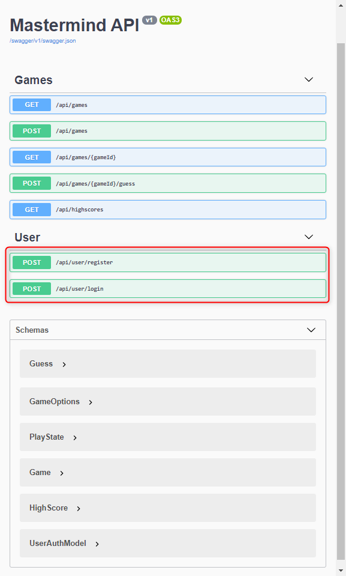
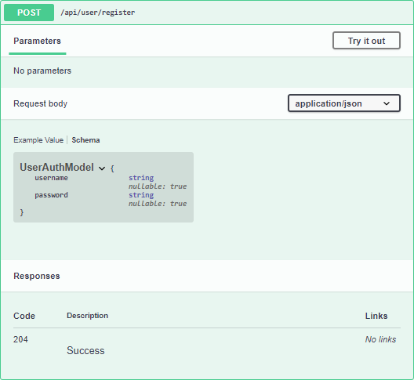
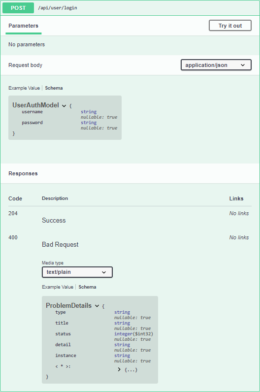

# Labor 07 - Angular Haladó

<details open>

<summary>Ez a dokumentum egyedi stíluslapot tartalmaz.</summary>

GitHubon az alábbi CSS nyers szövegként jelenik meg, VS Code-ban viszont értelmezésre kerül (tehát kiértékelődik, és a blokkok "szépek" lesznek), ezért a nyers szöveg nem látható.

<style>
details {
  padding-left: 1em;
  border: 1px solid;
  background: #7773;
  margin-bottom: 0.5em;
}
details summary {
  font-size: 1.2em;
  cursor: pointer;
  color: #69f;
}
details summary:hover {
  color: #58a;
}
</style>

</details>

## Bevezetés

A labor folyamán a hallgatók jelen anyag segítségével önállóan végeznek feladatokat a webes technológiák gyakorlati megismerése érdekében.

Ez a labor az [előző labor](../06%20-%20Angular%202) folytatása, a szükséges fejlesztői eszközök megegyeznek, a korábbi végállapotot folytatjuk. Az előző laborok ismereteinek megszerzése jelen labor elvégzéséhez erősen ajánlott.

> *Figyelem!* Az Angular laborok során számos, viszonylag nagyméretű (többszáz megabájt) függőségi csomag letöltésére lesz szükség (az `npm install` parancs hatására), de ha valaki már sikeresen telepítette a korábbi labor során az NPM csomagokat, akkor azokat várhatóan nem kell újra letölteni.

> Ha VS Code-ban (az egyedi formázásokkal) szeretnéd látni a leírást, akkor klónozd ezt repository-t a gépedre, és nyisd meg a megfelelő laborhoz tartozó README.md fájlt! A jobb felső sarokban tudod megnyitni a vizuális előnézetet. Javasolt a labor tényleges megkezdése előtt minden esetben pull-ozni a távoli forrást, hátha valami esetleg frissült.
>
> `git clone https://github.com/bmeaut/VIAUBB03.git`

## Előkészítés

Ha nincs meg az előző labor végállapota a gépünkön (vagy szeretnénk biztosra menni), akkor töltsük le a [kiinduló projektet](labor-6-kiindulo.zip), csomagoljuk ki egy tetszőleges munkamappába a tartalmát, majd a projekt mappájában adjuk ki az alábbi parancsokat a VS Code beépített termináljának segítségével (`Ctrl+ö`):

> `npm install`

> `ng serve`

*Fontos!* Ha a parancsok nem futnak le, akkor az <a href="../05 - Angular 1/#kiindulas" target="_blank">első Angular labor Kiindulás fejezetében leírtakat</a> vizsgáljuk meg!

Ha sikeresen lefutnak a parancsok, az alkalmazást megnyithatjuk a <http://localhost:4200>-as porton:


### Módosítások

Az alkalmazást fel kell készítenünk arra, hogy kezeljen URL-eket.

Nevezzük át az `app.component.*` fájlokat `game.component.*`-ra (F2 vagy jobb klikk -> Rename), helyezzük őket az `src\app\game` mappába (javítsuk az importok elcsúszását tehát `./` helyett `../` legyen), nevezzük át az `AppComponent`-et `GameComponent`-re és a `game.component.ts` fájl `@Component` dekorátorát módosítsuk az alábbira:

`src\app\game\game.component.ts`:

``` TS
@Component({
  selector: 'mm-game',
  templateUrl: './game.component.html',
  styleUrls: ['./game.component.scss']
})
export class GameComponent {
  // ...
```

Ezután hozzuk újra létre az AppComponent-et:

> `ng generate component app --flat --selector=mm-root`

Az alkalmazásunk mostantól routing-ot fog használni (alapértelmezetten a CLI routing-engedélyezett alkalmazást készít, mi ezt eredetileg kikapcsoltuk), ehhez importáljuk a `RouterModule`-t az `@angular/router` csomagból, majd vegyük fel a saját alkalmazásunk függőségei (`imports`) közé a RouterModule egy paraméterezett verzióját az alábbi módon:

`app.module.ts`:

``` TS
RouterModule.forRoot([ // import { RouterModule } from '@angular/router';
  { path: 'game', component: GameComponent } // import { GameComponent } from './game/game.component';
])
```

Ez az útvonal a `/game` URL-re a `GameComponent`-et fogja betölteni arra a helyre, ahol az alkalmazásunk template-jében a `<router-outlet>` nevű elem szerepel. Ha visszaemlékszünk, ezt töröltük az első alkalommal, így most az `app.component.html` kódja legyen ismét az alábbi:

``` HTML
<router-outlet>
  <!-- Ide fog kerülni tehát az URL által meghatározott komponens.-->
</router-outlet>
```

Az AppModule-ban a most hibásan GameComponentnek gondolt bootstrap elemet, tehát az alkalmazás belépési pontját, le kell cserélni ismét az AppComponentre (ha refaktorálta a VS Code nekünk).

<details open>

<summary>Ha mindent jól csináltunk, az `src\app\app.module.ts` fájl tartalma az alábbi lesz.</summary>

``` TS
import { BrowserModule } from '@angular/platform-browser';
import { NgModule } from '@angular/core';
import { RouterModule } from '@angular/router';
import { NgbModule } from '@ng-bootstrap/ng-bootstrap';

import { GameComponent } from './game/game.component';
import { PegComponent } from './peg/peg.component';
import { GameOverComponent } from './game-over/game-over.component';
import { AppComponent } from './app.component';

@NgModule({
  declarations: [
    AppComponent,
    GameComponent,
    PegComponent,
    GameOverComponent
  ],
  imports: [
    BrowserModule,
    NgbModule,
    RouterModule.forRoot([
      { path: 'game', component: GameComponent }
    ])
  ],
  providers: [],
  bootstrap: [AppComponent]
})
export class AppModule { }
``` 

</details>

Ha problémába ütköztünk, akkor töltsük le a [labor-7.1-kiindulo.zip](labor-7.1-kiindulo.zip) fájlt, és folytassuk innen.

Ha most elindítjuk a kódot, meglepődhetünk, hogy a [http://localhost:4200](http://localhost:4200)-on nem jön be semmi. Ez azért van, mert nem definiáltunk alapértelmezett útvonalat és/vagy nem adtuk meg, melyik komponens töltődjön be a gyökér útvonalon. Ugyanakkor ez azt jelenti, hogy a játékunk továbbra is elérhető, csak most már a [http://localhost:4200/game] URL-en.

## Bejelentkezés felület

A bejelentkezéshez kell készítenünk egy felületet, ahol a felhasználó nevét és jelszavát fogjuk bekérni. Ugyanitt legyen lehetőség regisztrációra is, amikor a jelszót kétszer kell megadni.

Vegyünk fel egy új komponenst LoginComponent néven!

> `ng g c login`

<details open>

<summary>A LoginComponent-et regisztráljuk be a `login` és `register` útvonalakra! Mindkét esetben ugyanazt a komponenst fogjuk használni.</summary>

``` TS
RouterModule.forRoot([
  { path: 'game', component: GameComponent },
  { path: 'login', component: LoginComponent },
  { path: 'register', component: LoginComponent }
]),
```

</details>

Angular segítségével a komponenseink [konstruktor injektálás](https://angular.io/guide/architecture-services) segítségével használhatják az Angular által adott, illetve a magunk által definiált szolgáltatásokat. 

<details open>

<summary>Injektáljuk be az ActivatedRoute szolgáltatást a LoginComponentbe, és ennek segítségével frissítsünk egy 'register' nevű tulajdonságot, ha az aktuális útvonal a 'register'-re mutat!</summary>

``` TS
register: boolean;

constructor(private route: ActivatedRoute) { // import { ActivatedRoute } from '@angular/router';
}

ngOnInit(): void {
  this.route.url.subscribe(e => {
    this.register = e[0].path === 'register';
    console.log(this.register);
  });
}
```

A fenti segítségével tehát el tudjuk dönteni bármelyik adott időpillanatban, hogy a `/register` vagy `/login` oldalon van a LoginComponens meghívva.

**Fontos**, hogy az ActivatedRoute sok `Observable` típusú tulajdonságot ad nekünk. Az `Observable` egy tervezési mintában részt vevő objektum, a nevéből is adódóan ő egy *megfigyelhető*. A megfigyelését a `subscribe()` függvény meghívásával tudjuk elkezdeni, aminek átadhatjuk a megfigyelés kezelésére szánt függvényt, ebben az esetben megnézzük, hogy az aktuális URL érték első tagja a `register` érték-e, és kiírjuk az eltárolt értéket a konzolra.

**Fontos**, hogy a feliratkozást, és egyébként minden logikát ne a konstruktorban, hanem az `ngOnInit()` függvényben végezzünk! Az Angular változásdetektálási mechanizmusa (a keretrendszer vizsgálja, hogy mikor kell újrarajzolni a felületet) először elvégzi a kezdeti adatkötést (pl. `@Input`, `@Output` dekorátorral ellátott tulajdonságok létrehozása, értékadása), és ezután hívja meg az `ngOnInit()` függvényt. Ezért jó szokás, ha minden inicializálási logikát azonnal ebbe a függvénybe teszünk, nem pedig a konstruktorba.

</details>

A LoginComponent tehát el tudja dönteni, hogy a `register` vagy a `login` oldalon vagyunk. Ennek függvényében minimálisan különböző tartalmú űrlapokat kell megjelenítenünk.

A LoginComponentben hozzunk létre egy űrlapot, amin 3 mező szerepel: `username`, `password`, `passwordAgain`. Legutóbbi csak akkor látható, ha a `register` oldalon vagyunk.

Az űrlap alján legyen egy link, ami `/login` esetén a `/register`-re mutat, `/register` esetén pedig a `/login`-ra.

Az űrlap `(submit)` eseményére iratkoztassunk fel egy eseménykezelőt submitForm néven, ami a konzolra írja a `username`, `password` és `passwordAgain` értékét!

<details open>

<summary>Készítsük el a fentieknek megfelelően az űrlapot!</summary>

`src\app\login\login.component.ts`:

``` TS
username = '';
password = '';
passwordAgain = '';

submitForm() {
  console.log([this.username, this.password, this.passwordAgain]);
}
```

`src\app\login\login.component.html`:

``` HTML
<main class="container-fluid text-center my-5">
    <form (submit)="submitForm()" class="co l-xl-3 col-lg-4 col-md-6 col-sm-8 m-auto">
        <div class="card">
            <h1 class="card-title m-5">{{register ? 'Register' : 'Sign in'}} to Mastermind</h1>
            <div class="card-body">
                <div class="card-text">
                    <div class="input-group my-5">
                        <input [value]="username" name="username" type="text" class="form-control form-control-lg text-center"
                            placeholder="Input your username here." required>
                    </div>
                    <div class="input-group my-5">
                        <input [value]="password" name="password" type="password" class="form-control form-control-lg text-center"
                            placeholder="Input your password here." required>
                    </div>
                    <div class="input-group my-5" *ngIf="register">
                        <input [value]="passwordAgain" name="passwordAgain" type="password" class="form-control form-control-lg text-center"
                            placeholder="Input your password once more." required>
                    </div>
                    <button type="submit" class="btn btn-block btn-primary">Submit</button>
                </div>
            </div>
            <div class="card-footer">
                <a *ngIf="register" href="/login">Have an account?</a>
                <a *ngIf="!register" href="/register">Don't have an account?</a>
            </div>
        </div>
    </form>
</main>
```

</details>

Teszteljük a működést! Az oldal gyökér útvonala még nincsen komponenshez kötve, így teszteljük a <http://localhost:4200/login> URL-en!

Érdemes észrevennünk, hogy az oldal alján a navigációs linkek újratöltik a teljes oldalt, ami nem túl SPA-hoz méltó viselkedés... Ne közvetlenül navigáljunk, hanem engedjük az alkalmazásnak kezelni a saját navigációját! Ehhez az alábbi kódrészletet kell megadnunk:

``` HTML
<a *ngIf="register" routerLink="/login">Have an account?</a>
<a *ngIf="!register" routerLink="/register">Don't have an account?</a>
```

Ebben az esetben az Angular fog a navigációban közreműködni (a böngésző beépített működése helyett), így nem fog újraindulni a teljes alkalmazásunk a navigáció során. Fontos, hogy a fenti megegyezik az alábbi szintaxissal:

``` HTML
<a *ngIf="register" [routerLink]="'/login'">Have an account?</a>
```

Észre is vehetjük, hogy konstans érték "adatkötésekor" nincsen szükség a *valódi* adatkötésre, egyszerűen csak konstans értéket adunk át. Másik esetben a string értéket stringként kell jeleznük, ugyanis az nem stringként, hanem kódként értékelődik ki. Ez a működés gyakorlatilag megegyezik a HTML elemek attribútum értékének beállításával, azok ugyanis az átadott stringet beállítják az elemen, tekinthetők konstansnak.

A routerLink egy Angular [direktíva](https://angular.io/guide/attribute-directives), melynek segítségével az Angular alkalmazásunk routingjának megfelelő, akár paraméterezett linkeket tudunk generálni. A direktívák (a legtöbbször adatkötés segítségével) funkcióval bővítik ki az adott DOM elemet, amin elhelyezésre kerülnek.

Ezeken túl azt is láthatjuk, hogy az oldal újratöltődik a gomb megnyomásakor is, de természetesen ezt sem szeretnénk, mivel AJAX-szal szeretnénk kommunikálni, és alkalmazáson belül navigálni.

Ahhoz, hogy a navigációt meggátoljuk, importáljuk a `FormsModule`-t (`@angular/forms`) is az alkalmazásmodulunkhoz:

``` TS
imports: [
  BrowserModule,
  NgbModule,
  RouterModule.forRoot([
    { path: 'game', component: GameComponent },
    { path: 'login', component: LoginComponent },
    { path: 'register', component: LoginComponent }
  ]),
  FormsModule // import { FormsModule } from '@angular/forms';
],
```

Ugyanekkor észrevehetjük, hogy az adatok, amiket "elküldünk" (kiírunk a konzolra) a gomb nyomásának hatására, nem ugyanazok, amiket begépeltünk a felületen. Ennek az oka, hogy mi **egyirányú adatkötést** végeztünk (`[value]="username"`), ez tehát a DOM-ba elhelyezi a `username` értékét, de a felület nem fogja frissíteni azt! Ebben az esetben [kétirányú adatkötést](https://angular.io/guide/template-syntax#two-way-binding-) használunk az `[(ngModel)]` segítségével, ami a *banán a dobozban* szintaxisra hallgat:

``` HTML
<div class="input-group my-5">
    <input [(ngModel)]="username" name="username" type="text" class="form-control form-control-lg text-center" placeholder="Input your username here." required>
</div>
<div class="input-group my-5">
    <input [(ngModel)]="password" name="password" type="password" class="form-control form-control-lg text-center" placeholder="Input your password here." required>
</div>
<div class="input-group my-5" *ngIf="register">
    <input [(ngModel)]="passwordAgain" name="passwordAgain" type="password" class="form-control form-control-lg text-center" placeholder="Input your password once more." required>
</div>
```

Ha ennek megfelelően töltjük ki az űrlap többi részeit, akkor láthatjuk, hogy megfelelő adatok kerülnek a `submitForm()` függvényünkben kiírásra a konzolra.

Angularban lehetőségünk van a template-ben kétféle referencia-változó létrehozására: DOM elemre vagy direktíva példányra mutató template változók léteznek.

Tiltsuk le a küldéshez használt gombot, ha nem megfelelőek az adatok (esetünkben a required attribútumnak nem megfelelő értékük van)! Ehhez használjuk a HTML Form elemen automatikusan létrejövő [NgForm](https://angular.io/api/forms/NgForm) direktívát:

``` HTML
<form #loginForm="ngForm" (submit)="submitForm()" class="col-xl-3 col-lg-4 col-md-6 col-sm-8 m-auto">
...
    <button type="submit" class="btn btn-block btn-primary" [disabled]="loginForm.invalid">Submit</button>
...
</form>
```

A direktíva példányt tehát el tudtuk kérni a template-ben, beletettük egy (csak a template-ben látható) változóba, majd használtuk adatkötésre, hogy a gombot letiltsuk ezáltal.

Idő szűkéből adódóan a jelszavak egyezésére készülő validátort nem írunk most. [Bővebben az űrlap validációról itt lehet olvasni.](https://angular.io/guide/form-validation)

## Szerver kommunikáció

Az alkalmazásunk mostantól szerverrel fog kommunikálni. A webes fejlesztés során nagyon gyakori, hogy a frontendért és backendért felelős csapatok egymástól függetlenül dolgoznak, ezért elképzelhető, hogy már kész szerverhez kell a frontendet igazítani, de az is előfordul, hogy a szerver még nincsen kész. Mindkét helyen (szerveren és kliensen is) szokás az adatokat tesztadatokkal helyettesíteni (ún. *mock*). Mi most készen kapjuk a szervert, azzal tudunk tesztelni. A [szerveralkalmazás készen futtatható ASP.NET Core verziója letölthető innen](https://github.com/yugabe/Mastermind/releases/).

A szerver a http://localhost:5000 címen érhető el, az alább is látható leíró felület a http://localhost:5000/swagger URL-en érhető el indítás után. A szervernek LocalDb adatbázisra van szüksége (pl. Visual Studioval települ), konzol alkalmazásként futtatható.



Ebből most a regisztrációt és belépést fogjuk elkészíteni:





Hozzunk létre egy új service-t, ami az API-val történő kommunikációt fogja végezni:

> `ng g s api`

Nagyobb alkalmazások esetén érdemes a kódot a leíró alapján generálni, vagy több szolgáltatást létrehozni az API-val történő kommunikációra. Nekünk most ez nem sok munka, úgyhogy kézzel fogjuk elkészíteni a szükséges objektumokat.

Az API néhány modellobjektumot fog várni, illetve ezekkel fog visszatérni (ezeket részletesen láthatjuk a Swagger UI felületén). A `models\api` mappát hozzuk létre, ebbe vegyük fel az alábbi fájlokat:

`src\app\models\api\game-options.dto.ts`:

``` TS
export interface GameOptionsDto {
  maximumKeyValue: number;
  maximumNumberOfPossibleGuesses: number;
  keyLength: number;
  allowDuplicates: boolean;
}
```

`src\app\models\api\guess.dto.ts`:

``` TS
export interface GuessDto {
  numbers: number[];
  numbersAtRightPlace: number;
  numbersAtWrongPlace: number;
}
```

`src\app\models\api\high-score.dto.ts`:

``` TS
export interface HighScoreDto {
  user: string;
  playTimeInSeconds: number;
  date: string;
  guessesMade: number;
  possibleValues: number;
  maximumPossibleGuesses: number;
  allowDuplicates: boolean;
}
```

`src\app\models\api\play-state.ts`:

``` TS
export type PlayState = 'InProgress' | 'Lost' | 'Won';
```

`src\app\models\api\user-auth.dto.ts`:

``` TS
export interface UserAuthDto {
  username: string;
  password: string;
}
```

`src\app\models\api\index.ts`:

``` TS
import { GameOptionsDto } from './game-options.dto';
import { GameDto } from './game.dto';
import { GuessDto } from './guess.dto';
import { HighScoreDto } from './high-score.dto';
import { PlayState } from './play-state';
import { UserAuthDto } from './user-auth.dto';

export { GameOptionsDto, GameDto, GuessDto, HighScoreDto, PlayState, UserAuthDto };
```

`src\app\models\api\game.dto.ts`:

``` TS
import { GuessDto, GameOptionsDto, PlayState } from '.';

export interface GameDto {
  elapsedSecons: number;
  gameCreated: string;
  givenGuesses: GuessDto[];
  id: string;
  userId: string;
  options: GameOptionsDto;
  playState: PlayState;
}
```

Érdekesség az `index.ts` fájl, aminek segítségével importáljuk az összes API-hoz szükséges modellt és egy ponton exportáljuk. Így a `\models\api` hivatkozás importálásával mindent egyetlen fájlból importálhatunk (tranzitív módon), ahogyan ez a `game.dto.ts`-ben látható is.

Ezek után az `ApiService`-ünkben az Angular [`HttpClient`](https://angular.io/api/common/http/HttpClient) szolgáltatását használva hívjuk a megfelelő végpontokat. A `HttpClient` használatához a modulunkba importálni kell a `HttpClientModule`-t, ami a `HttpClient`-et tartalmazza.

`src\app\app.module.ts`:

``` TS
  imports: [
    // ...
    FormsModule,
    HttpClientModule // import { HttpClientModule } from '@angular/common/http'
  ],
```

Az ApiService pedig használja a szükséges DTO-kat és a HttpClient megfelelő metódusat (`get`, `post`) ahhoz, hogy meghívja a szerver végpontokat:

`src\app\api.service.ts`:

``` TS
import { Injectable } from '@angular/core';
import { HttpClient } from '@angular/common/http';
import { GameDto, GameOptionsDto, HighScoreDto } from './models/api';

@Injectable({
  providedIn: 'root'
})
export class ApiService {

  private static readonly baseUrl: string = "http://localhost:5000/api/";

  constructor(private http: HttpClient) { }

  login(username: string, password: string) {
    return this.http.post<void>(`${ApiService.baseUrl}user/login`, { username, password }, { withCredentials: true });
  }

  register(username: string, password: string) {
    return this.http.post<void>(`${ApiService.baseUrl}user/register`, { username, password }, { withCredentials: true });
  }

  getGames() {
    return this.http.get<GameDto[]>(`${ApiService.baseUrl}games`, { withCredentials: true });
  }

  postGame(options: GameOptionsDto) {
    return this.http.post<GameDto>(`${ApiService.baseUrl}games`, options, { withCredentials: true });
  }

  getGame(gameId: string) {
    return this.http.get<GameDto>(`${ApiService.baseUrl}games/${gameId}`, { withCredentials: true });
  }

  postGuess(gameId: string, numbers: number[]) {
    return this.http.post<GameDto>(`${ApiService.baseUrl}games/${gameId}/guess`, numbers, { withCredentials: true });
  }

  getHighScores(entries?: number) {
    return this.http.get<HighScoreDto[]>(`${ApiService.baseUrl}highscores${entries != 0 ? `?entries=${entries}` : ''}`, { withCredentials: true })
  }
}

```

Láthatjuk, hogy a fenti kód analóg a leíró által definiált végpontokkal, azok paramétereivel és visszatérési értékével.

A `{ withCredentials: true }` opció átadására alapértelmezetten nincsen szükség, ugyanis ez a domainek közötti kommunikáció esetén nem engedélyezi pl. a sütik átküldését és fogadását. Éles környezetben az alkalmazás a leggyakrabban CORS whitelist-en szerepel vagy a szerver ugyanazon domainen érhető el (pl. a /api URL-en). Fontos, hogy a webalkalmazások alapértelmezetten nem engedélyezik a különböző hosztok/domainek közötti AJAX kéréseket böngészőben. A használt webalkalmazás a http://localhost:4200 URL-en futó szervert whitelist-re helyezte. Ez a jelenség a [CORS](https://developer.mozilla.org/en-US/docs/Web/HTTP/CORS), illetve Angular-ben használható az alkalmazás fejlesztésekor a dev szerver [proxy](https://angular.io/guide/build#proxying-to-a-backend-server) lehetősége.

A belépést a szerver süti alapú jogosultságkezeléssel kezeli, a `login` és `register` végpontokon kívül semmit nem tudunk meghívni, amíg nincsen birtokolt sütink. Sütit sikeres belépés vagy regisztráció után kapunk, külön kezelnünk nem szükséges (a böngésző beépítetten kezeli), leszámítva a mostani helyzetet, amikor cross-domain sütit használunk, ekkor a [`withCredentials`](https://developer.mozilla.org/en-US/docs/Web/API/XMLHttpRequest/withCredentials) flag beállítása szükséges. Ha nincsen érvényes sütink, válaszüzenetben egy 401-es HTTP választ kapunk.

Lehetőségünk van arra is, hogy a flag-et minden kérésünkhöz, vagy rendszerezetten adott kérésekhez fűzzük hozzá, vagy a 401-es hívások hatására átirányítsuk a felhasználót a login oldalra. Ehhez Angularben [HTTP Interceptorokat](https://angular.io/api/common/http/HttpInterceptor) használhatunk.

<details open>

<summary>Valósítsuk meg, hogy sikeres belépést/regisztrációt követően a /menu URL-re kerüljünk a Router (https://angular.io/guide/router) szolgáltatás segítségével, valamint az alkalmazás alapértelmezetten irányítson át a /login URL-re.</summary>

Természetesen fel kell vennünk ehhez egy újabb komponenst, amit nevezzünk MenuComponentnek:

> `ng g c menu`

Regisztráljuk be az útvonalak közé, egyúttal a gyökér útvonal átirányítását is:

`src\app\app.module.ts`:

``` TS
RouterModule.forRoot([
  { path: 'game', component: GameComponent },
  { path: 'login', component: LoginComponent },
  { path: 'register', component: LoginComponent },
  { path: 'menu', component: MenuComponent },
  { path: '', redirectTo: 'login', pathMatch: 'full' }
]),
```

A Router segítségével irányítsuk át a felhasználót a "menu" abszolút URL-re.

`src\app\login\login.component.ts`:

``` TS
constructor(
  private route: ActivatedRoute, 
  private api: ApiService, // import { ApiService } from '../api.service';
  private router: Router) { // import { Router } from '@angular/router';
}
submitForm() {
  if (this.register) {
    this.api.register(this.username, this.password).subscribe(() => {
      this.router.navigateByUrl("menu");
    }, error => {
      console.error(error);
    })
  }
  else {
    this.api.login(this.username, this.password).subscribe(() => {
      this.router.navigateByUrl("menu");
    }, error => {
      console.error(error);
    })
  }
}
```

</details>

A MenuComponent-ben megfelelően lekérhetjük a folyamatban levő játékokat a játékos számára az alábbi módon:

`src\app\menu\menu.component.ts`:

``` TS
  constructor(private api: ApiService) { } // import { ApiService } from '../api.service';

  games: GameDto[]; // import { GameDto } from '../models/api';
  
  ngOnInit(): void {
    this.api.getGames().subscribe(games => {
      console.log(games);
      this.games = games;
    });
  }
```

## Önálló feladatok

Önállóan elvégezhetők az alábbi feladatok a szerver használatával, gyakorlás (szorgalmi) jelleggel:
- Menü oldal: a felhasználó folyamatban levő játékainak listázása (`/api/games`), kiválasztása és a toplista megjelenítése (`/api/highscores`).
- Játék indítása: a `\menu` URL-en a játék indításához fel kell tudni konfigurálni a szükséges `GameOptionsDto` objektumot egy űrlap segítségével (vagy kiválasztani egy már futó játékot a listából). Használható validátor is, ugyanis minimum és maximum érték korlátozások vannak az opciókon. A GameOptionsDto elküldése után a visszakapott játék elindított állapotban van, tehát ennek felületét szükséges megjeleníteni a jelenlegi `game.component.ts`-ben. A GameComponent [URL paraméterben várja a játék ID-ját](https://angular.io/guide/router#route-parameters).
- Tipp beküldése: a tipp beküldése immár aszinkron módon fog történni, tehát a megfelelő tipp elküldésekor a `.subcribe()` operátorral fel kell iratkozni a válaszra, ott pedig a megfelelő logika alapján eldönteni, hogy a játéknak vége lett-e, valamint megjeleníteni a teljes játékteret.
